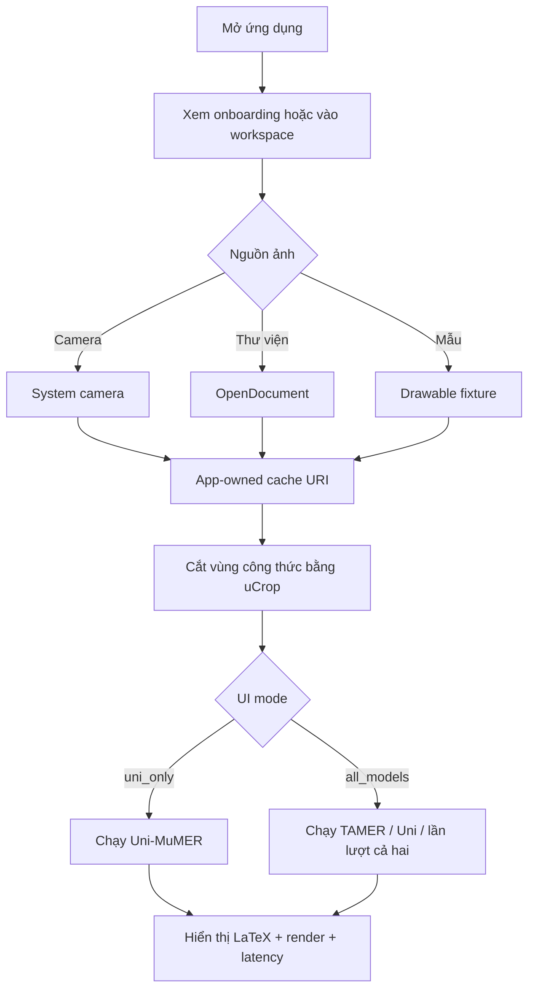
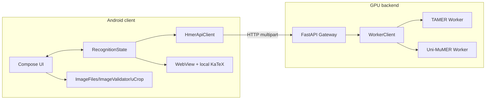

# Báo cáo  — University HMER: Nhận dạng biểu thức toán đại học viết tay


## Thông tin về project

Đề tài xây dựng một hệ thống end-to-end nhận dạng biểu thức toán viết tay từ ảnh và trả về mã LaTeX. Hệ thống gồm ứng dụng Android viết bằng Kotlin/Jetpack Compose và backend Python/FastAPI có khả năng chạy hai hướng mô hình: TAMER-A3, một mô hình chuyên biệt có decoder nhận biết cấu trúc cây, và Uni-MuMER kết hợp LoRA riêng của dự án, một mô hình thị giác-ngôn ngữ được thích nghi cho bài toán HMER. Ứng dụng cho phép chọn ảnh hoặc chụp bằng camera hệ thống, cắt vùng công thức bằng uCrop, gửi ảnh qua API và render kết quả cục bộ bằng KaTeX.

Hai mô hình có hệ phụ thuộc GPU khác nhau nên backend được tách thành một gateway và hai worker độc lập. Gateway cung cấp contract chung, xác thực ảnh, quản lý request ID và chuyển tiếp request đến worker tương ứng. Docker Compose cô lập runtime CUDA/PyTorch, mount model artifact từ bên ngoài Git và mặc định chỉ mở gateway trên loopback. Dự án sử dụng lưới an toàn gồm unit test, contract test, integration test ba service, Android instrumented test và acceptance test trên GPU thật. Tại lần kiểm tra hiện tại, backend local đạt 32 test pass và 1 test real-GPU được skip đúng điều kiện; bằng chứng acceptance trước đó trên RTX 3090 Ti ghi nhận cả hai model trả HTTP 200, `mock=false` và giữ output fixture mong đợi.

Kết quả quan trọng của đề tài không chỉ là bản demo chạy được mà còn là kiến trúc có ranh giới rõ: Android là thin client, gateway ổn định API, mỗi model được bọc bởi adapter riêng và các điểm nhạy cảm checkpoint/parser được bảo vệ bằng characterization tests. Báo cáo đồng thời nêu rõ giới hạn: model weights không nằm trong Git, các số liệu khoa học trên giao diện cần gắn provenance trước khi dùng làm kết quả luận văn, backend chưa được thiết kế để public trực tiếp ra Internet và một số nhánh camera/LaTeX validation vẫn cần test bổ sung.


## 1. Đặt vấn đề

Biểu thức toán không chỉ là chuỗi ký tự một chiều. Vị trí tương đối giữa ký hiệu tạo ra phân số, căn, chỉ số trên/dưới, ma trận và nhiều cấu trúc lồng nhau. Vì vậy HMER phải giải quyết đồng thời ba khó khăn:

1. nét viết tay và chất lượng ảnh thay đổi theo người viết, giấy, ánh sáng và camera;
2. ký hiệu dễ nhầm lẫn, ví dụ `1/l`, `0/O`, dấu trừ và gạch phân số;
3. output LaTeX có cấu trúc phân cấp, nên dự đoán đúng token nhưng sai ngoặc hoặc quan hệ không gian vẫn làm công thức sai.

Các encoder–decoder tuần tự giải quyết tốt nhiều trường hợp nhưng có thể học cấu trúc LaTeX một cách ngầm định. Nghiên cứu TAMER đề xuất Tree-Aware Module, tối ưu đồng thời sequence và tree-structure prediction, rồi sử dụng điểm cấu trúc trong beam search để tăng tính hợp lệ của output ([Zhu và cộng sự, TAMER](https://arxiv.org/abs/2408.08578)). Một hướng khác là dùng vision-language model đã pretrain. Uni-MuMER xây dựng khung fine-tuning đa nhiệm gồm Tree-Aware Chain-of-Thought, Error-Driven Learning và Symbol Counting trên CROHME/HME100K ([Li và cộng sự, Uni-MuMER](https://arxiv.org/abs/2505.23566)).

Từ đó, đề tài đặt câu hỏi thực hành: làm thế nào đưa hai hướng model khác nhau vào một ứng dụng Android thống nhất, có thể demo trên điện thoại/emulator, tái lập trên máy GPU và vẫn kiểm soát được rủi ro thay đổi code?

## 2. Mục tiêu, phạm vi và tiêu chí thành công

### 2.1 Mục tiêu chức năng

- Thu nhận ảnh công thức từ thư viện, camera hệ thống hoặc ảnh mẫu.
- Cho người dùng crop vùng công thức trước khi nhận dạng.
- Gửi ảnh đến backend bằng một contract chung.
- Chạy Uni-MuMER ở giao diện mặc định; cho phép bật TAMER và so sánh bằng build config.
- Hiển thị LaTeX thô, công thức render và latency.
- Cung cấp health check, lỗi có cấu trúc và request ID xuyên service.
- Hỗ trợ mock mode không cần GPU và real mode trên GPU.

### 2.2 Mục tiêu chất lượng

- Kết nối model weights từ Hugging Face và setup tự động download cho người dùng
- Mỗi model có runtime riêng để tránh xung đột dependency.
- Refactor đầy đủ API contract, checkpoint shape hoặc exact fixture output.
- Có test cho state/orchestration Android, URI ownership, gateway/worker contract, deployment layout và TAMER checkpoint.


## 3. Cơ sở lý thuyết và công trình tham khảo

### 3.1 Transformer và attention

Transformer thay thế recurrence bằng attention, cho phép mô hình hóa quan hệ giữa các vị trí và tăng khả năng song song khi huấn luyện ([Vaswani và cộng sự, 2017](https://arxiv.org/abs/1706.03762)). Trong HMER, encoder biến ảnh thành feature map; decoder dùng self-attention để mô hình quan hệ giữa token đã sinh và cross-attention để liên kết token với vùng ảnh.

### 3.2 Cấu trúc cú pháp của biểu thức toán

LaTeX tuần tự biểu diễn một cấu trúc hai chiều. Hướng syntax-aware trước đó chuyển markup thành parsing tree và coi dự đoán sequence như quá trình duyệt cây; công trình này cũng giới thiệu HME100K, tập dữ liệu quy mô 100 nghìn biểu thức từ nhiều người viết ([Yuan và cộng sự, CVPR 2022](https://openaccess.thecvf.com/content/CVPR2022/papers/Yuan_Syntax-Aware_Network_for_Handwritten_Mathematical_Expression_Recognition_CVPR_2022_paper.pdf)). Runtime TAMER trong dự án chứa parser LaTeX ↔ GTD/tree, structural target và tree scoring để bảo vệ liên hệ này.

### 3.3 TAMER

TAMER kết hợp dự đoán chuỗi và cấu trúc cây trong kiến trúc Transformer. Ở mức source của dự án:

- DenseNet encoder trích đặc trưng ảnh và truyền padding mask;
- decoder có Tree-Aware/structure module và attention refinement;
- mô hình huấn luyện theo hai hướng;
- beam search tạo hypothesis và trộn điểm sequence với điểm cấu trúc;
- vocabulary đổi token ID thành LaTeX.

Dự án không tuyên bố phát minh TAMER. Đóng góp của nhóm là tích hợp/runtime adaptation, dữ liệu trường/augmentation, contract tests, deployment worker và ứng dụng demo dựa trên phương pháp đã công bố.

DenseNet được TAMER dùng làm image feature extractor; ý tưởng kết nối dày đặc giữa các layer xuất phát từ công trình [Densely Connected Convolutional Networks](https://arxiv.org/abs/1608.06993). Coverage/attention refinement trong họ HMER cũng có liên hệ với hướng coverage-aware Transformer như [CoMER](https://arxiv.org/abs/2207.04410); trong báo cáo này, hành vi cụ thể vẫn được mô tả theo source TAMER đang triển khai.

### 3.4 Uni-MuMER và vision-language model

Uni-MuMER khai thác một VLM đã pretrain và đưa tri thức HMER vào qua các nhiệm vụ dữ liệu có cấu trúc. Paper mô tả Tree-CoT, EDL và Symbol Counting ([Li và cộng sự](https://arxiv.org/abs/2505.23566)). Repository này **không chứa toàn bộ code huấn luyện đa nhiệm của paper**; phần runtime nạp base model đã pin revision, gắn PEFT LoRA adapter riêng của dự án và dùng prompt đa phương thức để sinh LaTeX. Phân biệt này cần được giữ rõ trong báo cáo để không đồng nhất “dùng model/ý tưởng Uni-MuMER” với “tự cài đặt toàn bộ phương pháp nghiên cứu”.

### 3.5 LoRA

LoRA đóng băng trọng số pretrained và thêm các ma trận hạng thấp có thể huấn luyện vào layer, giảm số tham số cần cập nhật và nhu cầu bộ nhớ so với full fine-tuning ([Hu và cộng sự, 2021](https://arxiv.org/abs/2106.09685)). Repository Git chỉ lưu metadata/tokenizer/config cần thiết. LoRA weight và base model là deployment artifacts được cấp riêng; base model được lấy từ kho Hugging Face private/được cấp quyền và không đưa vào Git.

### 3.6 Công nghệ giao diện và dịch vụ

- Jetpack Compose dùng state để mô tả UI; khi state thay đổi, Compose recompose phần liên quan. Kiến trúc được tổ chức theo luồng event → state → UI, phù hợp với hướng unidirectional data flow trong [tài liệu kiến trúc Compose](https://developer.android.com/develop/ui/compose/architecture).
- Camera sử dụng [`ActivityResultContracts.TakePicture`](https://developer.android.com/reference/androidx/activity/result/contract/ActivityResultContracts.TakePicture); thư viện sử dụng `OpenDocument`; app không truy cập camera sensor bằng CameraX.
- uCrop cung cấp màn chọn vùng ảnh ([Yalantis/uCrop](https://github.com/Yalantis/uCrop)).
- KaTeX render LaTeX từ assets cục bộ theo [KaTeX API](https://katex.org/docs/api), không cần CDN.
- FastAPI nhận file/form multipart theo [tài liệu upload chính thức](https://fastapi.tiangolo.com/tutorial/request-files/) và middleware được dùng để gắn request context theo [tài liệu middleware](https://fastapi.tiangolo.com/tutorial/middleware/).
- Docker Compose cấp GPU cho service bằng device reservation/`gpus` theo [Docker GPU support](https://docs.docker.com/compose/how-tos/gpu-support/).

## 4. Phân tích yêu cầu

### 4.1 Tác nhân

| Tác nhân | Mục tiêu |
|---|---|
| Người dùng Android | đưa ảnh vào, crop, chạy model và đọc/sao chép LaTeX |
| Thành viên phát triển | chạy mock nhanh, build/test APK, thay đổi UI có kiểm soát |
| Người vận hành GPU | chuẩn bị weights/cache, chạy preflight, build Compose và theo dõi health |
| Giảng viên/người đánh giá | tái lập quy trình, xem source/test/evidence và giới hạn |

### 4.2 Use case chính



### 4.3 Contract chức năng

Gateway cung cấp:

- `GET /health` → trạng thái gateway và hai model;
- `POST /predict` với multipart `image` và `model` (`tamer_a3` hoặc `unimumer_lora`) → model, LaTeX, latency, metadata ảnh, `mock`, `request_id`.

Ảnh được giới hạn 10 MiB, format JPEG/PNG/WEBP, cạnh tối thiểu 64 px và phải có contrast/detail tối thiểu. Đây là heuristic phát hiện ảnh gần trắng, không phải model nhận dạng công thức.

## 5. Thiết kế hệ thống

### 5.1 Kiến trúc tổng thể



### 5.2 Các pattern được sử dụng

| Pattern/nguyên tắc | Cách áp dụng |
|---|---|
| Thin client | Android không chứa model; tập trung input, state, network và presentation |
| Logical layers | presentation, application/state, device/image boundary, remote inference |
| Adapter | `TamerA3Adapter`, `UniMumerLoraAdapter` cùng thỏa `InferenceAdapter` |
| Factory method | `create_worker_app()` sinh worker API thống nhất |
| API Gateway/Façade | Android chỉ biết một base URL và một `/predict` contract |
| Dependency inversion nhỏ | `RecognitionRunner` phụ thuộc `HmerApi` interface, dễ fake trong unit test |
| Immutable state transition | `RecognitionState` trả bản sao mới thay vì mutate rải rác |
| Defense in depth | ảnh được kiểm tra ở Android, gateway và worker |
| Characterization/contract testing | khóa behavior legacy trước và sau refactor |
| Configuration over branching source | mock/real và `uni_only/all_models` qua environment/build property |

Không nên gọi Android hiện tại là “MVVM” hoặc toàn dự án là “Clean Architecture” theo nghĩa hình thức: code không có ViewModel, repository, use-case layer hoặc DI framework. Tên chính xác hơn là kiến trúc phân lớp logic, state một chiều và interface/factory ở các boundary cần test.

### 5.3 Sử dụng 2 workers độc lập

TAMER cần môi trường legacy PyTorch 2.0.1 + CUDA 11.8 + PyTorch Lightning 1.9.5, trong khi Uni-MuMER dùng Transformers/PEFT với runtime CUDA 12.6 mới hơn. Ép cả hai vào một Python environment làm tăng nguy cơ xung đột dependency và phá checkpoint. Tách container cho phép:

- pin phiên bản theo model;
- restart/load một model độc lập;
- giữ gateway nhẹ và không cần CUDA;
- mock API không import thư viện model nặng;
- thay adapter mà không đổi Android contract.

## 6. Android App

### 6.1 Entry và điều hướng

Manifest mở `MainActivity`; Activity dựng Compose theme rồi gọi `HmerDemoApp`. App dùng conditional composition để chuyển giữa onboarding và recognition. `RecognitionStartMode` biểu diễn workspace rỗng hoặc khởi tạo bằng ảnh mẫu, thay cho Boolean khó hiểu.

### 6.2 Thu nhận và sở hữu ảnh

- Gallery: `OpenDocument` → kiểm tra MIME/size/dimensions → copy vào cache app.
- Camera: tạo URI bằng non-exported `FileProvider` → `TakePicture` → cùng pipeline import.
- Sample: copy drawable vào cache và trả FileProvider URI.
- Crop: tạo output riêng, cấp URI permission cho uCrop và chỉ bật nút model khi có `croppedImageUri`.
- Clear/change source: chỉ xóa URI có authority của app, không xóa file bên ngoài.

Không có camera ID hardcode. Trên điện thoại, system camera quyết định camera trước/sau; trên emulator, webcam laptop/camera rời được map trong AVD mà không sửa Kotlin.

### 6.3 State và orchestration

`RecognitionState` là data class bất biến. Chọn nguồn mới làm vô hiệu crop/kết quả cũ; crop thành công làm input sẵn sàng; `start/complete/fail/finish` mô tả vòng đời nhận dạng. `RecognitionRunner` gọi health rồi chạy model theo thứ tự, phát outcome riêng cho từng model để lỗi một model không chặn model còn lại.

Chế độ so sánh chạy tuần tự, không chạy hai GPU request song song. Lựa chọn này làm thứ tự/UX xác định và giảm nguy cơ peak resource, nhưng tổng latency bằng tổng hai lượt.

### 6.4 Giao tiếp HTTP

Client dùng `HttpURLConnection`, tự tạo multipart boundary, gửi `model`, file `image` và `X-Request-ID`. Timeout được đặt theo model. Response JSON được parse thành `PredictionResult`; error envelope được chuyển thành `HmerApiException` có code/message.

Base URL được compile vào `BuildConfig`:

- emulator: `http://10.0.2.2:8000`;
- điện thoại thật: `http://127.0.0.1:8000` cùng `adb reverse`;
- GPU từ xa: SSH tunnel về loopback laptop.

### 6.5 Render kết quả

`JSONObject.quote()` biến LaTeX thành JavaScript string an toàn trước khi chèn vào HTML. WebView load JS/CSS/font KaTeX từ `android_asset`, tắt network load/content access/window opening và đặt KaTeX `trust=false`. Người dùng vẫn xem được raw LaTeX và sao chép vào clipboard.

### 6.6 Cấu hình UI model

Gradle property `HMER_MODEL_UI_MODE` chỉ chấp nhận:

- `uni_only`: một nút Uni-MuMER, mặc định;
- `all_models`: TAMER-A3, Uni-MuMER và nút so sánh.

Giá trị lạ làm build thất bại. Cơ chế này giữ code model/API còn nguyên trong khi demo mặc định được đơn giản hóa.

## 7. Backend

### 7.1 Gateway

Gateway đọc settings từ environment, cài request-ID middleware và đăng ký error handler. `/health` gọi song song hai worker. `/predict` đọc tối đa 10 MiB + 1 byte, validate ảnh, chọn worker theo `ModelName` và Pydantic-validate response trước khi trả Android.

### 7.2 Worker client và xử lý lỗi

`WorkerClient` tái sử dụng `httpx.AsyncClient`. Timeout được đổi thành HTTP 504 `MODEL_TIMEOUT`; connection failure thành 503; response success sai schema thành 502; worker error giữ status/code/message có cấu trúc. Request ID được chuyển tiếp sang worker và trả lại caller.

### 7.3 Worker factory

`create_worker_app()` dùng chung cho hai model:

- mock mode trả LaTeX fixture và latency mô phỏng;
- real mode lazy-load hoặc eager-load adapter;
- blocking load/inference được chạy bằng `asyncio.to_thread`;
- health phân biệt `ready` và `configured`;
- output rỗng/runtime error được chuẩn hóa.

### 7.4 TAMER adapter

Adapter kiểm tra project/checkpoint/dictionary, lazy-import runtime, khởi tạo vocabulary, load checkpoint với `strict=True`, chuyển model sang CUDA nếu có và đặt `eval()`. Predict chuyển ảnh grayscale thành tensor `1×1×H×W`, tạo mask không padding, chạy `approximate_joint_search()` trong inference mode và ánh xạ hypothesis token IDs về LaTeX.

### 7.5 Uni-MuMER adapter

Adapter nạp processor/base model cùng một revision SHA đã pin và `trust_remote_code=True`, gắn PEFT LoRA adapter, chọn `bfloat16` trên CUDA và `float32` trên CPU. Inference dùng prompt đa phương thức, greedy generation (`do_sample=false`, một beam), cắt prompt tokens và decode output.

### 7.6 Xác thực ảnh

Backend không tin filename hoặc MIME do client gửi. Pillow verify/decode ảnh, kiểm tra format/kích thước rồi grayscale thumbnail để đo global contrast và high-frequency detail. Ảnh gần trắng trả `NO_FORMULA_CONTENT`. Gateway và worker đều chạy validator.

### 7.7 Triển khai GPU

Docker Compose tạo ba service. Chỉ gateway publish `127.0.0.1:8000`; worker không publish 8101/8102. Project/model mount từ host; TAMER project mount read-only; Uni-MuMER nhận Hugging Face cache riêng. Worker chạy real mode và eager-load trước health. Quy định GPU trong Compose phù hợp hướng dẫn chính thức của Docker về cấp accelerator cho service ([Docker Docs](https://docs.docker.com/compose/how-tos/gpu-support/)).

## 8. TAMER và phần thiết kế Data

### 8.1 Data pipeline

Data module đọc image/label, áp dụng transform, padding ảnh trong batch và tạo mask. `UniversityDataModule` kết hợp dữ liệu trường với HME replay. `BalancedReplayBatchSampler` giữ tỷ lệ replay theo seed để giảm quên kiến thức cũ khi fine-tune.

### 8.2 Dynamic augmentation

`DynamicPaperAugmentation` mô phỏng:

- nền giấy tổng hợp hoặc nền thật;
- variation mực;
- perspective/page-on-desk;
- bóng và ánh sáng không đều;
- blur, noise, resize/compression giống camera.

Augmentation dùng RNG theo seed/sample/epoch, cho phép tái lập test nhưng vẫn thay đổi theo epoch huấn luyện.

### 8.3 LaTeX domain utilities

Project chuẩn hóa/tokenize LaTeX, kiểm tra cân bằng ngoặc và cú pháp script, phân loại dạng công thức, chuyển LaTeX ↔ tree/GTD, rồi tính metric theo toàn bộ tập và theo nhóm. Parser/cây là code nhạy cảm: đổi thứ tự token hoặc special ID có thể làm checkpoint mất tương thích.

### 8.4 Retention-aware training

`LitUniversityTAMER` thêm freeze encoder theo epoch, validation tách university/HME và retention penalty. Mục tiêu là cải thiện miền dữ liệu mới nhưng giới hạn mức giảm ExpRate trên HME baseline. Cơ chế này là phần hiện thực cụ thể của dự án, khác với LoRA của Uni-MuMER.

### 8.5 So sánh hai hướng model trong project

| Tiêu chí | TAMER-A3 | Uni-MuMER + LoRA dự án |
|---|---|---|
| Họ mô hình | HMER chuyên biệt | Vision-language model |
| Ảnh đầu vào | Grayscale | RGB |
| Encoder | DenseNet | Vision encoder của Qwen |
| Decoder | Transformer tree-aware tùy biến | Language model của Qwen |
| Cấu trúc | parent-tree/structure score explicit | tri thức cấu trúc học từ fine-tuning/prompt |
| Decoding | beam hai hướng + reverse/tree rerank | greedy deterministic generation |
| Adaptation dự án | gated bottleneck adapter trong checkpoint | LoRA rank thấp gắn lên base Uni-MuMER |
| Vocabulary | dictionary HMER 248 token gồm special tokens | tokenizer VLM quy mô lớn |
| Ưu điểm | nhỏ hơn, dễ giải thích, kiểm soát cấu trúc rõ | khả năng thị giác–ngôn ngữ rộng, output linh hoạt |
| Hạn chế | parser/dictionary hữu hạn, runtime legacy | model/cache lớn, prompt/remote-code sensitive |

Hai hướng dùng chung API nhưng không phải hai cấu hình của cùng một model; preprocessing, dependency, decoding và artifact đều khác nhau. Đây là lý do kỹ thuật trực tiếp của kiến trúc hai worker.


## 9. Kiểm thử và kết quả

### 9.1 Chiến lược test

| Tầng | Loại test | Mục tiêu |
|---|---|---|
| Android state | JUnit | transition, model mode, orchestration, latency |
| Android device | Instrumented/Compose | UI controls, URI ownership, network policy, smoke |
| Backend unit | pytest | settings, request context, worker factory, error mapping |
| Backend integration | ba Uvicorn process mock | health/predict multipart qua gateway thật |
| TAMER domain | pytest | padding/mask, vocabulary, LaTeX, metrics, augmentation/sampler |
| Checkpoint | state manifest + real contract | key/shape và exact fixture output |
| Deployment | static contract + preflight | path, bind, runtime version, checksum |
| GPU acceptance | Docker/real request | container health, CUDA, `mock=false`, output/latency |


### 9.2 Ý nghĩa các metric

- **ExpRate/Expression Recognition Rate:** tỷ lệ biểu thức được nhận dạng hoàn toàn đúng; một token sai làm cả biểu thức sai.
- **TER/Token Error Rate:** mức lỗi theo token/edit distance, phản ánh sai khác cục bộ.
- **Valid LaTeX:** cần có định nghĩa cụ thể là parser/cú pháp nào kiểm tra. Trong backend hiện tại, field `valid_latex` được đặt `true` khi output không rỗng; vì vậy **không được dùng field này như bằng chứng cú pháp khoa học**.
- **Latency:** phải ghi hardware, warm/cold start, số mẫu, percentile/mean và điều kiện đo nếu dùng làm kết quả chính thức.

Các số metric đang hiển thị trong `strings.xml` là nội dung tĩnh. Trước khi nộp, nhóm phải bổ sung bảng nguồn gồm dataset split, checkpoint, script đánh giá, commit và file result cho từng số; nếu không có bằng chứng, chuyển chúng thành “mục tiêu/minh họa” hoặc bỏ khỏi phần kết quả.

## 10. Đánh giá kết quả và đóng góp

### 10.1 Đóng góp kỹ thuật

- Một Android demo hoàn chỉnh từ image acquisition đến LaTeX presentation.
- Một API contract duy nhất che giấu khác biệt giữa specialized model và VLM.
- Hai GPU worker cô lập dependency và có mock/real lifecycle chung.
- Tích hợp TAMER checkpoint + vocabulary + beam search vào service.
- Tích hợp pinned base VLM + PEFT LoRA vào service.
- Pipeline dữ liệu trường, augmentation camera và retention-aware training cho TAMER.
- Lưới safety-net bảo vệ UI state, URI, API, deployment, checkpoint và domain behavior.
- Tài liệu chạy Windows/Android/Ubuntu GPU và network tunnel.

### 10.2 Giá trị thực hành

Hệ thống cho phép trình diễn bài toán HMER trên thiết bị gần với người dùng cuối, đồng thời giữ compute nặng ở GPU server. Mock mode rút ngắn vòng lặp phát triển UI; worker isolation giúp bảo trì hai model không đồng thế hệ; contract test làm giảm nguy cơ refactor “chạy được nhưng đổi kết quả”.

### 10.3 Những gì không phải đóng góp mới

- Kiến trúc Transformer, LoRA, TAMER và Uni-MuMER là công trình tham khảo.
- Base model/checkpoint/dataset ngoài nhóm phải được trích dẫn và tuân thủ license.
- KaTeX, uCrop, AndroidX, FastAPI, PyTorch, Hugging Face/PEFT và Docker là công nghệ bên thứ ba.

## 11. Hạn chế và hướng phát triển


### 11.1 Những hạn chế

- Android phải chặn `health=false/degraded`, kiểm tra response model và dùng request ID khi báo lỗi.
- Revalidate crop output, downsample preview và giới hạn decoded pixels.
- Thêm LaTeX syntax validator thật hoặc đổi nghĩa/tên `valid_latex`.
- Thêm real Uni-MuMER test, image-validator tests và HTTP client tests.
- Chuyển screen state sang ViewModel/`SavedStateHandle` nếu cần sống qua rotation/process recreation.
- Chạy worker bằng non-root user, mount/cache tối thiểu quyền và hash base-model artifacts.

### 11.2 Hướng nghiên cứu

- Benchmark theo loại cấu trúc và độ phức tạp thay vì chỉ metric tổng.
- Phân tích lỗi ký hiệu tương tự, ngoặc/cây và công thức dài.
- So sánh accuracy–latency–VRAM giữa TAMER và Uni-MuMER trên cùng hardware.
- Nghiên cứu ensemble/reranking dựa trên tree validity nhưng kiểm soát chi phí.
- Mở rộng dữ liệu camera thật, domain adaptation và robustness theo điều kiện ánh sáng.
- Hiệu chỉnh confidence/uncertainty để người dùng biết khi nào cần sửa thủ công.

## 12. Kết luận

University HMER chứng minh một pipeline đầy đủ từ ảnh công thức trên Android đến suy luận GPU và hiển thị LaTeX. Kiến trúc không cố ép hai model khác thế hệ vào cùng runtime; gateway và adapter giữ contract chung trong khi worker cô lập dependency. Refactor tập trung vào khả năng hiểu, kiểm thử và rollback: state/orchestration được tách khỏi UI, worker lifecycle được dùng lại và các behavior nhạy cảm checkpoint được khóa bằng contract tests.

Ở trạng thái hiện tại, project phù hợp cho private academic demo và tiếp tục nghiên cứu, với điều kiện model artifacts được cấp riêng và network giữ ở loopback/tunnel. Để trở thành dịch vụ production public hoặc báo cáo benchmark khoa học hoàn chỉnh, nhóm còn phải bổ sung authentication/TLS/rate limits, provenance metric, test camera/Uni real tự động và quy trình license/experiment evidence chặt chẽ hơn.

## Tài liệu tham khảo

1. A. Vaswani et al., “Attention Is All You Need,” 2017. [arXiv:1706.03762](https://arxiv.org/abs/1706.03762).
2. Y. Yuan et al., “Syntax-Aware Network for Handwritten Mathematical Expression Recognition,” CVPR 2022. [CVF Open Access](https://openaccess.thecvf.com/content/CVPR2022/papers/Yuan_Syntax-Aware_Network_for_Handwritten_Mathematical_Expression_Recognition_CVPR_2022_paper.pdf).
3. J. Zhu et al., “TAMER: Tree-Aware Transformer for Handwritten Mathematical Expression Recognition,” AAAI 2025. [AAAI paper](https://ojs.aaai.org/index.php/AAAI/article/download/33190/35345), [arXiv:2408.08578](https://arxiv.org/abs/2408.08578).
4. Y. Li et al., “Uni-MuMER: Unified Multi-Task Fine-Tuning of Vision-Language Model for Handwritten Mathematical Expression Recognition,” NeurIPS 2025 Spotlight. [arXiv:2505.23566](https://arxiv.org/abs/2505.23566).
5. E. J. Hu et al., “LoRA: Low-Rank Adaptation of Large Language Models,” 2021. [arXiv:2106.09685](https://arxiv.org/abs/2106.09685).
6. Android Developers, “Compose Architecture.” [developer.android.com](https://developer.android.com/develop/ui/compose/architecture).
7. Android Developers, “ActivityResultContracts.TakePicture.” [developer.android.com](https://developer.android.com/reference/androidx/activity/result/contract/ActivityResultContracts.TakePicture).
8. Yalantis, “uCrop — Image Cropping Library for Android.” [GitHub](https://github.com/Yalantis/uCrop).
9. KaTeX, “API Documentation.” [katex.org](https://katex.org/docs/api).
10. FastAPI, “Request Files” và “Middleware.” [fastapi.tiangolo.com](https://fastapi.tiangolo.com/tutorial/request-files/), [middleware](https://fastapi.tiangolo.com/tutorial/middleware/).
11. Docker, “Run Docker Compose services with GPU access.” [docs.docker.com](https://docs.docker.com/compose/how-tos/gpu-support/).
12. G. Huang et al., “Densely Connected Convolutional Networks,” 2016. [arXiv:1608.06993](https://arxiv.org/abs/1608.06993).
13. W. Zhao et al., “CoMER: Modeling Coverage for Transformer-based Handwritten Mathematical Expression Recognition,” 2022. [arXiv:2207.04410](https://arxiv.org/abs/2207.04410).
14. Android Developers, “FileProvider” và “Network Security Configuration.” [FileProvider](https://developer.android.com/reference/androidx/core/content/FileProvider), [Network Security Configuration](https://developer.android.com/privacy-and-security/security-config).
15. Hugging Face, “PEFT LoRA.” [huggingface.co/docs/peft](https://huggingface.co/docs/peft/main/en/package_reference/lora).

## Cấu trúc repository

```text
SERVER_BACKUP/
├── android-ui-project/                 # Android/Kotlin/Compose
│   ├── app/src/main/java/...           # UI, state, image, HTTP
│   ├── app/src/main/res/               # strings, policy, FileProvider, samples
│   ├── app/src/main/assets/katex/       # renderer offline
│   └── app/src/test + androidTest/      # local/device tests
├── hmer-deploy-essential-20260721/app/
│   ├── backend/
│   │   ├── gateway/                    # public API façade
│   │   ├── shared/                     # contracts/errors/settings/worker factory
│   │   ├── workers/tamer/              # TAMER service adapter
│   │   ├── workers/unimumer/           # VLM + LoRA service adapter
│   │   └── tests/                       # backend safety net
│   └── hmer-project/
│       ├── tamer/                       # model/data/training runtime
│       ├── outputs/.../best_adapter/    # tracked metadata, not all weights
│       └── tests/                       # model/domain contracts
└── docs/                                # run guide và hai project reports
```
