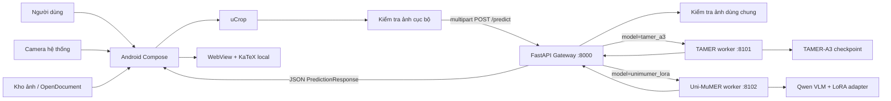
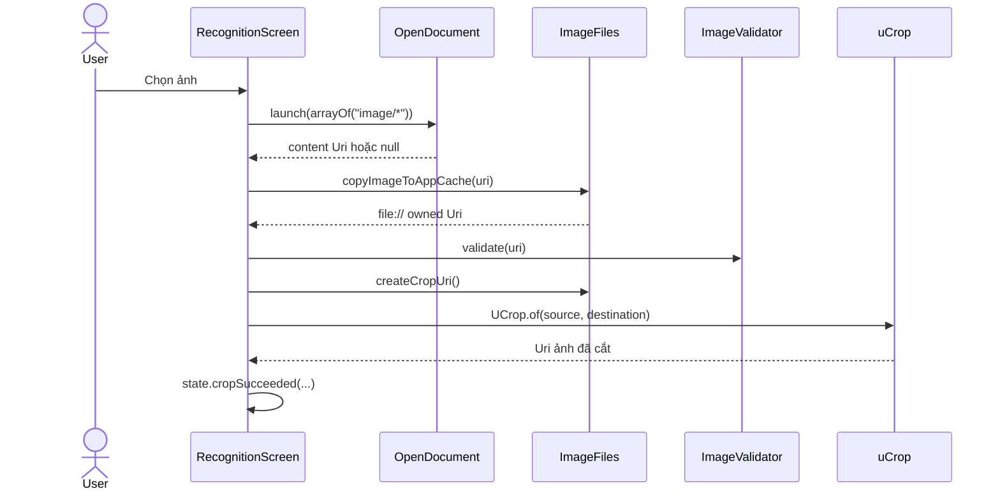
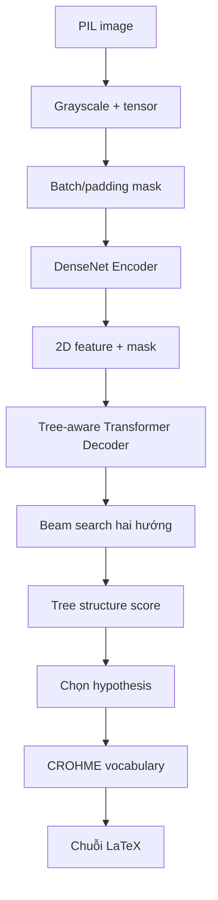
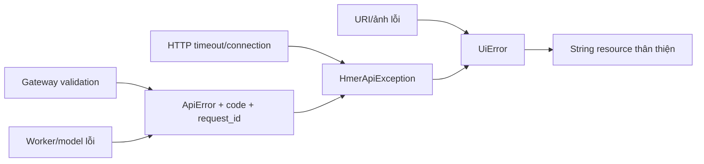

# Báo cáo 1 — Hướng dẫn đọc và hiểu toàn bộ mã nguồn University HMER

> Mục đích: giúp thành viên dự án có thể tự lần theo mã nguồn, hiểu dữ liệu đi đâu, hàm nào gọi hàm nào, phần nào thuộc giao diện, API, triển khai hoặc mô hình học máy.

## 0. Phạm vi và cách đọc báo cáo

| Thuộc tính | Giá trị |
|---|---|
| Phiên bản mã được phân tích | commit `315ee2e386ea9c35611f857758a7be132ba7515d` |
| Nhánh tham chiếu | `main` |
| Công cụ lập bản đồ mã | CodeGraph 0.9.9 |
| Kết quả index | 111 file, 1.219 node, 2.188 edge |
| Ngôn ngữ chính | Kotlin/Jetpack Compose, Python/FastAPI/PyTorch, YAML/XML/Kotlin DSL |
| Phạm vi | Android app, gateway, hai worker, TAMER runtime, Uni-MuMER adapter, cấu hình triển khai và test |

Báo cáo dùng ba mức chi tiết:

1. **Luồng hệ thống** giải thích một thao tác của người dùng đi xuyên qua các thành phần nào.
2. **Giải phẫu file lõi** giải thích các khối lệnh theo dòng và lý do tồn tại.
3. **Chỉ mục mã nguồn** liệt kê file, lớp, hàm, dòng bắt đầu–kết thúc và quan hệ chính. Đây là lớp tra cứu để không bỏ sót hàm nhỏ.

Không có ý nghĩa thực tế khi “giải thích từng byte” của font `.ttf/.woff`, ảnh PNG, `gradle-wrapper.jar` hoặc tokenizer JSON. Các file dữ liệu/nhị phân này được liệt kê và giải thích vai trò, nguồn sử dụng và ranh giới an toàn; phần mã thực thi mới được phân tích theo dòng.

## 1. Dự án làm gì?

University HMER là hệ thống nhận dạng biểu thức toán viết tay từ ảnh và trả về chuỗi LaTeX. Người dùng có thể:

- chọn ảnh từ thiết bị hoặc chụp bằng ứng dụng camera hệ thống;
- cắt đúng vùng chứa công thức bằng uCrop;
- kiểm tra ảnh trước khi gửi;
- gửi ảnh đến cùng một API gateway;
- chạy Uni-MuMER LoRA ở chế độ giao diện mặc định, hoặc bật cấu hình để hiện thêm TAMER-A3 và chế độ so sánh hai mô hình;
- xem LaTeX thô, bản công thức được KaTeX render cục bộ và thời gian suy luận;
- sao chép kết quả hoặc xóa ảnh để bắt đầu lại.

Mô hình không chạy trực tiếp trong APK. Android chỉ quản lý trải nghiệm người dùng và gọi HTTP. Hai mô hình chạy trong hai Python worker độc lập trên máy có GPU; gateway xác thực request, chọn worker và chuẩn hóa response.

## 2. Bức tranh kiến trúc



### 2.1 Ranh giới trách nhiệm

| Thành phần | Chịu trách nhiệm | Không chịu trách nhiệm |
|---|---|---|
| Android | URI ảnh, camera/thư viện, crop, state UI, gọi API, render LaTeX | tải/giữ model, suy luận GPU |
| Gateway | request ID, validate ảnh, chọn worker, timeout, chuẩn hóa lỗi | nạp model hoặc thực hiện tensor inference |
| Worker dùng chung | health/predict contract, mock/real mode, lazy/eager loading | biết chi tiết giao diện Android |
| TAMER adapter | nạp checkpoint và dictionary, tiền xử lý ảnh, beam search | route HTTP công khai |
| Uni-MuMER adapter | nạp base VLM đúng revision và PEFT adapter, generate LaTeX | quản lý camera/crop |
| Docker Compose | cô lập môi trường phụ thuộc, volume model, GPU, healthcheck | xác thực người dùng Internet |

## 3. Luồng chạy từ đầu đến cuối

### 3.1 Khởi động ứng dụng

1. Android khởi tạo [`MainActivity`](../../android-ui-project/app/src/main/java/vn/edu/fpt/hmerdemo/MainActivity.kt), dòng 10–20.
2. `onCreate()` bật edge-to-edge, rồi gọi `setContent { HMERDEMOTheme { HmerDemoApp() } }`.
3. [`HmerDemoApp`](../../android-ui-project/app/src/main/java/vn/edu/fpt/hmerdemo/ui/HmerDemoApp.kt), dòng 12–32, giữ trạng thái đang ở onboarding hay recognition.
4. Khi người dùng bắt đầu, enum [`RecognitionStartMode`](../../android-ui-project/app/src/main/java/vn/edu/fpt/hmerdemo/ui/RecognitionStartMode.kt), dòng 3–6, truyền ý định khởi đầu rõ nghĩa thay vì một Boolean mơ hồ.
5. [`RecognitionScreen`](../../android-ui-project/app/src/main/java/vn/edu/fpt/hmerdemo/ui/recognition/RecognitionScreen.kt), dòng 58–409, trở thành bộ điều phối chính của màn nhận dạng.

### 3.2 Chọn ảnh từ thư viện



Ứng dụng dùng `OpenDocument`, không dùng Android Photo Picker mới. URI ngoài ứng dụng được validate rồi sao chép vào cache do app sở hữu trước khi crop. Cách này tránh phụ thuộc quyền đọc URI tạm thời trong suốt vòng đời dài hơn của thao tác. Output uCrop hiện **không được validate lại cục bộ**; nó được backend kiểm tra khi upload. Đây là khoảng trống robustness đã được ghi ở mục 10.3.

### 3.3 Chụp ảnh bằng camera

Ứng dụng không khóa vào camera ID `0`, không dùng CameraX và không mở webcam trực tiếp. Nó dùng `ActivityResultContracts.TakePicture`, nghĩa là Android/emulator quyết định ứng dụng camera và camera vật lý nào được dùng.

1. `ImageFiles.createCameraUri()` tạo một file JPEG tạm trong cache và trả URI qua `FileProvider`.
2. `RecognitionScreen` lưu URI này vào state tạm trước khi gọi launcher.
3. `TakePicture.launch(uri)` yêu cầu camera hệ thống ghi ảnh đúng vào URI đó.
4. Khi callback trả `true`, cùng pipeline validate → uCrop → validate → state được dùng như ảnh thư viện.
5. Khi callback trả `false`, file tạm được xóa để không tích lũy rác.

Hệ quả thực tế:

- điện thoại thật: đổi camera trước/sau trong giao diện camera của điện thoại;
- emulator: chọn nguồn webcam trong cấu hình AVD, ví dụ `webcam0` hoặc camera rời;
- laptop không cần sửa code `cameraId`; thay đổi nguồn camera ở Android Virtual Device Manager hoặc ứng dụng camera hệ thống.

### 3.4 Cắt và xác thực ảnh

[`ImageFiles`](../../android-ui-project/app/src/main/java/vn/edu/fpt/hmerdemo/image/ImageFiles.kt) quản lý quyền sở hữu file; [`ImageValidator`](../../android-ui-project/app/src/main/java/vn/edu/fpt/hmerdemo/image/ImageValidator.kt) quản lý điều kiện hợp lệ.

Hai tầng xác thực được chủ ý giữ riêng:

- **Android** phát hiện sớm URI lỗi, định dạng không được hỗ trợ, kích thước/ràng buộc ảnh bất hợp lý để người dùng nhận phản hồi nhanh.
- **Backend** không tin dữ liệu client; nó decode và kiểm tra lại byte ảnh, kích thước, MIME và nội dung công thức trước khi chạy model.

### 3.5 Chọn model và chạy nhận dạng

Build property `HMER_MODEL_UI_MODE` trong [`app/build.gradle.kts`](../../android-ui-project/app/build.gradle.kts) có hai giá trị hợp lệ:

| Giá trị | UI hiển thị |
|---|---|
| `uni_only` | một nút duy nhất chạy Uni-MuMER; đây là mặc định |
| `all_models` | TAMER-A3, Uni-MuMER và nút so sánh |

Giá trị build được chuyển thành `BuildConfig.HMER_MODEL_UI_MODE`, sau đó [`RecognitionModelMode.fromConfig()`](../../android-ui-project/app/src/main/java/vn/edu/fpt/hmerdemo/ui/recognition/RecognitionModelMode.kt) chuyển chuỗi cấu hình thành enum. Cấu hình lạ bị từ chối ngay khi Gradle configure, vì vậy lỗi không âm thầm lọt vào APK.

Khi bấm chạy:

1. `RecognitionScreen.runApi()` (dòng 227–253) xác định ảnh đã crop và model cần chạy.
2. `RecognitionState.start()` bật loading, dọn kết quả/lỗi liên quan.
3. Coroutine gọi [`RecognitionRunner.run()`](../../android-ui-project/app/src/main/java/vn/edu/fpt/hmerdemo/ui/recognition/RecognitionRunner.kt), dòng 27–61.
4. Runner gọi `HmerApi.predict()` cho từng model. Chế độ so sánh chạy hai lời gọi theo orchestration được test, rồi trả `RecognitionOutcome.Success` hoặc `Failure`.
5. UI gọi `state.complete()` hoặc `state.fail()`; khối `finally` gọi `state.finish()` để bảo đảm loading được tắt cả khi có exception.

### 3.6 HTTP từ Android đến gateway

Android không dùng Retrofit/OkHttp. [`HmerApiClient`](../../android-ui-project/app/src/main/java/vn/edu/fpt/hmerdemo/network/HmerApiClient.kt) dùng `HttpURLConnection` thủ công:

- `health()` (dòng 30–42) gọi `GET /health`, kiểm tra mã 2xx và trả body;
- `predict()` (dòng 44–97) tạo multipart boundary, ghi field `model`, ghi file `image`, nhận JSON và ánh xạ thành `PredictionResult`;
- hàm local `text()` (dòng 57) viết từng đoạn multipart bằng UTF-8;
- `open()` (dòng 99–106) áp dụng timeout và header chung cho mọi connection;
- `HmerApiException` giữ mã lỗi ổn định, thông báo và nguyên nhân gốc để lớp UI phân loại lỗi. Với response non-2xx, client đọc `error.code`/`error.message` từ body JSON trước khi tạo exception.

`BuildConfig.HMER_API_BASE_URL` mặc định là `http://10.0.2.2:8000`, tức host loopback nhìn từ Android Emulator. Điện thoại thật sử dụng `adb reverse tcp:8000 tcp:8000` và build URL `http://127.0.0.1:8000`. GPU từ xa đi qua SSH tunnel đến cổng 8000 của laptop.

### 3.7 Gateway xử lý request

[`gateway/app/main.py`](../../hmer-deploy-essential-20260721/app/backend/gateway/app/main.py) là public API nội bộ:

1. Dòng 15–18 tạo `GatewaySettings`, `WorkerClient`, `FastAPI` và cài request-context middleware.
2. `lifespan()` dòng 21–23 đóng `httpx.AsyncClient` khi app dừng.
3. `GET /health`, dòng 36–50, hỏi health hai worker; worker hỏng được phản ánh theo model nhưng gateway vẫn trả contract có cấu trúc.
4. `POST /predict`, dòng 54–84, lấy `request_id` từ middleware, đọc upload có giới hạn, gọi `validate_image()`, rồi chuyển byte đã được kiểm tra cho đúng worker.
5. Worker response được đóng gói thành `PredictionResponse`, giữ nguyên request ID để theo dõi một request xuyên hệ thống.

### 3.8 Gateway gọi worker

[`WorkerClient`](../../hmer-deploy-essential-20260721/app/backend/gateway/app/worker_client.py) là lớp duy nhất biết URL worker và cách ánh xạ lỗi mạng:

- `__init__()` tạo một `httpx.AsyncClient` tái sử dụng connection;
- `close()` giải phóng connection pool;
- `health()` đổi timeout/lỗi kết nối/HTTP lỗi thành trạng thái health ổn định;
- `predict()` chuyển tiếp ảnh multipart và `X-Request-ID`, kiểm tra JSON trả về bằng Pydantic, ánh xạ timeout thành lỗi 504 và unavailable thành 503.

Việc gom logic ở đây ngăn `gateway/main.py` bị trộn chi tiết transport.

### 3.9 Worker dùng chung

[`shared/worker_app.py`](../../hmer-deploy-essential-20260721/app/backend/shared/worker_app.py) áp dụng Template Method cho cả TAMER và Uni-MuMER:

- `InferenceAdapter` (dòng 16–25) là protocol: worker chỉ cần biết adapter có `loaded`, `device`, `load()`, `predict()`;
- `WorkerSpec` (dòng 29–38) chứa tên model, mode, eager-load và LaTeX mock;
- `create_worker_app()` (dòng 41–103) dựng FastAPI giống nhau cho hai model;
- `lifespan()` eager-load nếu cấu hình yêu cầu;
- `/health` phân biệt `mock`, `real loaded` và `real configured but unloaded`;
- `/predict` luôn validate ảnh, trả mock cố định hoặc lazy-load adapter rồi suy luận;
- output rỗng và runtime error được đổi thành contract lỗi thống nhất.

Nhờ factory này, hai file `workers/*/app/main.py` chỉ còn nhiệm vụ đọc settings, tạo adapter/spec và xuất biến `app`.

### 3.10 TAMER suy luận



[`TamerA3Adapter`](../../hmer-deploy-essential-20260721/app/backend/workers/tamer/app/adapter.py) nối HTTP worker với research runtime:

- `load()` thêm project root vào `sys.path`, khởi tạo vocabulary, load Lightning checkpoint, chuyển model sang CUDA nếu có và `eval()`;
- `predict()` chuyển ảnh PIL sang grayscale tensor, tạo padding mask, chạy trong `torch.inference_mode()`, gọi `approximate_joint_search()`, chọn hypothesis và đổi token ID thành LaTeX.

Lõi [`TAMER`](../../hmer-deploy-essential-20260721/app/hmer-project/tamer/model/tamer.py) gồm `Encoder`, `Decoder` và tùy chọn adapter. `_encode()` chuyển batch ảnh sang danh sách feature theo từng mẫu. `forward()` dùng khi train/teacher forcing. `beam_search()` dùng khi inference.

### 3.11 Uni-MuMER LoRA suy luận

[`UniMumerLoraAdapter`](../../hmer-deploy-essential-20260721/app/backend/workers/unimumer/app/adapter.py) nối worker với mô hình thị giác-ngôn ngữ:

1. `load()` nạp processor và base model theo tên cùng revision SHA đã pin.
2. PEFT `PeftModel.from_pretrained()` gắn LoRA adapter cục bộ lên base model.
3. Model được đặt `eval()` và adapter ghi lại device thực tế.
4. `predict()` tạo conversation/prompt cho ảnh, processor biến ảnh + text thành tensor, đưa tensor lên device, gọi `generate()` trong `torch.inference_mode()`.
5. Phần prompt token được loại khỏi sequence sinh; processor decode phần còn lại; hàm làm sạch lấy chuỗi LaTeX cuối.

Base model và cache không nằm trong Git. Compose mount `hf-cache` vào container; revision pin và offline flags giúp lần chạy được lặp lại sau khi cache đã chuẩn bị.

## 4. Giải phẫu Android theo file và dòng

### 4.1 `MainActivity.kt` — điểm vào Android

| Dòng | Ý nghĩa |
|---|---|
| 1–8 | Package và import Activity/Compose/theme. |
| 10 | `MainActivity : ComponentActivity` dùng host chuẩn cho Compose. |
| 11–19 | `onCreate`: gọi superclass, bật edge-to-edge, thiết lập cây Compose và theme. |
| 14–18 | `HMERDEMOTheme` bọc `HmerDemoApp`, nên màu/typography áp dụng cho toàn bộ app. |

Không chứa business logic; điều này giúp Activity không trở thành “god class”.

### 4.2 `HmerDemoApp.kt` — điều hướng cấp ứng dụng

| Dòng | Ý nghĩa |
|---|---|
| 12–32 | Composable gốc; nhớ trạng thái màn bằng Compose state. |
| Nhánh onboarding | Render `OnboardingScreen` và nhận callback bắt đầu. |
| Nhánh recognition | Render `RecognitionScreen` với `RecognitionStartMode` tương ứng. |

File này sau refactor chỉ còn khoảng 20 dòng thay vì chứa toàn bộ giao diện, state, HTTP và renderer trong một file lớn.

### 4.3 `ImageFiles.kt` — vòng đời file ảnh

| Hàm, dòng | Đầu vào → đầu ra | Vai trò và liên kết |
|---|---|---|
| `randomSampleUri()` 25–33 | drawable mẫu → URI app-owned | Chọn ảnh demo, chuyển resource thành file cache để dùng chung pipeline. |
| `copyImageToAppCache()` 35–55 | content URI → URI cache | Mở stream bằng `ContentResolver`, copy có giới hạn và trả URI qua FileProvider. |
| `createCameraUri()` 57–63 | không → URI JPEG | Chuẩn bị đích cho `TakePicture`. |
| `createCropUri()` 65–71 | không → URI PNG/JPEG crop | Chuẩn bị đích riêng cho uCrop, tránh ghi đè nguồn. |
| `deleteOwnedImage()` 73–79 | URI → xóa có điều kiện | Chỉ xóa file nằm trong vùng app sở hữu. |
| `clearTransientImages()` 81–88 | không → dọn cache tạm | Dọn camera/crop cũ, không đụng file ngoài app. |
| `readImageBytes()` 90–97 | URI → `ByteArray` | Cấp payload cho API client với kiểm tra kích thước. |
| `uriForFile()` 99–104 | `File` → content URI | Dùng authority `${applicationId}.fileprovider`. |

### 4.4 `ImageValidator.kt` — điều kiện ảnh được phép

`validate()` dòng 15–51 mở metadata/stream thông qua `ContentResolver`, xác nhận URI đọc được, định dạng ảnh hợp lệ, kích thước dương và giới hạn dung lượng/kích thước. Hàm trả thông báo lỗi có thể hiển thị thay vì ném lỗi thấp tầng ra UI. Đây là kiểm tra UX; backend vẫn kiểm tra lại.

### 4.5 `RecognitionState.kt` — máy trạng thái màn hình

| Hàm | Chuyển trạng thái |
|---|---|
| `selectSource()` 31–40 | thay nguồn ảnh, reset crop/result/error cũ |
| `cropSucceeded()` 42–49 | ghi URI crop hợp lệ và bật khả năng chạy |
| `start()` 51–57 | `isLoading=true`, xác định model đang chạy |
| `complete()` 59–63 | lưu một hoặc nhiều `ModelResult`, xóa lỗi |
| `fail()` 65–69 | lưu `UiError`, giữ state đủ để thử lại |
| `finish()` 71 | tắt loading trong `finally` |
| `clear()` 73 | trở về state ban đầu |

`ModelResult` dòng 7–11 chứa model, LaTeX và `formattedLatency`; UI không phải tự format giá trị latency nhiều lần.

### 4.6 `RecognitionRunner.kt` — orchestration có thể unit-test

`RecognitionOutcome` là sealed interface: compiler buộc caller xử lý `Success` và `Failure`. `RecognitionRunner.run()` nhận danh sách model, byte ảnh và callback API:

1. từ chối input/model list không hợp lệ;
2. chạy API cho từng model theo cấu hình;
3. gom `PredictionResult` thành `ModelResult`;
4. trả `Success(results)` khi toàn bộ hoàn tất;
5. đổi exception thành `RecognitionOutcome.Failure(model, HmerApiException)`; `RecognitionScreen` mới ánh xạ exception đó thành `UiError` để hiển thị.

Tách runner khỏi Composable giúp test logic mà không cần emulator.

### 4.7 `RecognitionScreen.kt` — bộ điều phối giao diện

Đây là file Android quan trọng nhất. Các nhóm dòng chính:

| Dòng | Trách nhiệm |
|---|---|
| 58–92 | Tạo context/scope, API, `ImageFiles`, state và URI tạm bằng `remember`. |
| 93–99 | `deleteOwnedImages()` dọn có chọn lọc nhiều URI mà không xóa URI ngoài app. |
| 101–102 | `validateImage()` ủy quyền cho `ImageValidator`. |
| 104–155 | Đăng ký launcher uCrop và xử lý success/cancel/error. |
| 157–182 | Launcher camera: chuẩn bị URI, nhận Boolean, rồi dùng đúng pipeline crop. |
| 184–214 | Launcher thư viện: copy URI ngoài app vào cache, validate, mở crop. |
| 216–225 | `clearRecognitionInput()` dọn file tạm và gọi `state.clear()`. |
| 227–253 | `runApi()` đọc byte, chuyển state sang loading, gọi runner, xử lý outcome, luôn finish. |
| 255–408 | Dựng Scaffold và truyền state/callback xuống các component thuần UI. |
| 411–414 | Adapter lỗi từ runner/client sang `UiError` của màn hình. |

Quy tắc quan trọng: callback launcher chỉ cập nhật state/khởi động bước kế tiếp; byte ảnh chỉ được đọc khi thật sự gọi API; file tạm được dọn khi thay nguồn hoặc clear.

### 4.8 `RecognitionComponents.kt` — component hiển thị

| Component/hàm | Dòng | Chức năng |
|---|---:|---|
| `RecognitionHeader` | 47–65 | tiêu đề và điều hướng |
| `ImageInputCard` | 67–149 | nút camera, thư viện, mẫu và xóa ảnh |
| `CropPlaceholder` | 151–170 | trạng thái chưa có ảnh crop |
| `FormulaImageBox` | 172–239 | preview ảnh công thức |
| `ModelControls` | 241–298 | hiện nút theo `RecognitionModelMode` |
| `LoadingCard` | 300–312 | phản hồi khi suy luận |
| `buildKatexHtml` | 314–392 | tạo HTML an toàn để render KaTeX offline |
| `LatexView` | 394–446 | WebView tải HTML KaTeX |
| `ResultCard` | 447–526 | LaTeX, latency, copy |
| `InlineErrorCard` | 528–562 | lỗi thân thiện và hành động thử lại |
| `copyLatex` | 564–567 | đưa kết quả vào clipboard |

Chuỗi hiển thị nằm trong `res/values/strings.xml`, không rải hardcode trong component. `buildKatexHtml()` encode dữ liệu đưa vào JavaScript/HTML để LaTeX không thể tùy tiện phá cấu trúc trang.

### 4.9 Onboarding, theme và resource

- `OnboardingScreen.kt` tách từng trang kể chuyện thành `ProblemStoryPage`, `ModelStoryPage`, `ExperienceStoryPage`; các component nhỏ `MetricCard`, `ModelStoryCard`, `StoryStep`, `PageIndicator` chỉ render dữ liệu.
- `HmerColors.kt`, `theme/Color.kt`, `Theme.kt`, `Type.kt` tập trung token giao diện.
- `strings.xml` là nguồn duy nhất cho nhãn như “Xóa ảnh”, “Cắt vùng công thức”, “TAMER-A3”, “Uni-MuMER” và “So sánh models”.
- `dimens.xml` giữ kích thước dùng lại.
- `network_security_config.xml` chỉ cho phép cleartext đến loopback/emulator aliases phục vụ demo, trong khi manifest đặt mặc định `usesCleartextTraffic=false`.
- `file_paths.xml` giới hạn phạm vi mà `FileProvider` có thể chia sẻ.
- `backup_rules.xml` và `data_extraction_rules.xml` kiểm soát backup/transfer dữ liệu app.

## 5. Giải phẫu backend theo file và dòng

### 5.1 Shared contracts

[`shared/contracts.py`](../../hmer-deploy-essential-20260721/app/backend/shared/contracts.py) định nghĩa schema Pydantic duy nhất cho:

- `ImageInfo` dòng 9–12: width, height, format;
- `WorkerPrediction` dòng 15–21: model, latex, latency, validity, image, mock, request ID;
- `PredictionResponse` dòng 24–25: cùng contract public, kế thừa/chuẩn hóa worker result;
- `WorkerHealth` dòng 28–32;
- `GatewayHealth` dòng 35–38.

Nhờ validate ở cả phía nhận worker và phía trả client, một worker trả JSON sai sẽ không bị gateway truyền mù quáng.

### 5.2 Errors và request context

[`shared/errors.py`](../../hmer-deploy-essential-20260721/app/backend/shared/errors.py):

- `ApiError` chứa HTTP status, mã máy đọc được và message người đọc được;
- `api_error_handler()` luôn trả JSON lỗi cùng cấu trúc và gắn request ID nếu có.

[`shared/request_context.py`](../../hmer-deploy-essential-20260721/app/backend/shared/request_context.py):

- middleware nhận `X-Request-ID` hợp lệ từ caller hoặc tạo UUID;
- lưu vào `request.state` để endpoint/error handler dùng chung;
- trả lại cùng ID trong response header, hỗ trợ trace Android → gateway → worker.

### 5.3 Settings

[`shared/settings.py`](../../hmer-deploy-essential-20260721/app/backend/shared/settings.py) thay thế hardcode rải rác:

- `_environment()` cho phép inject mapping giả trong test;
- `_mode_and_eager_load()` chuẩn hóa `mock|real` và quy tắc eager mặc định;
- `GatewaySettings.from_env()` đọc URL worker và timeout;
- `TamerSettings.from_env()` resolve project/checkpoint/dictionary;
- `UniMumerSettings.from_env()` resolve base model, revision, adapter và project root.

Path được resolve một lần ở biên cấu hình; code nghiệp vụ nhận object đã chuẩn hóa.

### 5.4 Validate ảnh backend

[`shared/image_validation.py`](../../hmer-deploy-essential-20260721/app/backend/shared/image_validation.py):

- `ValidatedImage` giữ PIL image và metadata đã tin cậy;
- `validate_image()` từ chối payload rỗng/quá lớn, decode bằng Pillow, xác nhận format trong allowlist và dimensions hợp lệ;
- `ensure_formula_content()` chuyển grayscale, đo vùng pixel khác nền để từ chối ảnh gần như trắng/không có công thức.

Pillow được yêu cầu load/decode trước khi model nhận ảnh; tên file và `Content-Type` của client không được dùng làm bằng chứng duy nhất.

### 5.5 Worker main files

Hai file `workers/tamer/app/main.py` và `workers/unimumer/app/main.py` có cùng dạng:

1. tính workspace/project root mặc định;
2. gọi settings tương ứng;
3. tạo adapter model;
4. tạo `WorkerSpec` gồm model ID, version, mode, eager-load, mock LaTeX;
5. gọi `create_worker_app()`.

Đây là composition root: nơi object được ghép với nhau, không phải nơi đặt inference logic.

### 5.6 Các khối backend nổi bật theo dòng

| File/dòng | Điều đang xảy ra | Lý do cần chú ý |
|---|---|---|
| `gateway/main.py:15–17` | Settings và HTTP client được tạo lúc import module | test/import environment ảnh hưởng cấu hình ban đầu |
| `gateway/main.py:20–23` | lifespan chỉ đóng client khi shutdown | gateway không load model |
| `gateway/main.py:35–50` | `asyncio.gather` fan-out health; `ready` và `configured` đều được chấp nhận | gateway `ready` chưa chắc model đã load nếu chạy lazy real |
| `gateway/main.py:53–84` | upload → byte-limit → validate → route → public response | đường dữ liệu public quan trọng nhất |
| `worker_client.py:43–49` | chọn URL từ mapping model và forward request ID | model routing tập trung |
| `worker_client.py:50–81` | timeout/connection/non-2xx/schema error được đổi thành `ApiError` | không để exception HTTPX rò ra contract |
| `image_validation.py:25–49` | thumbnail grayscale, độ lệch chuẩn, Gaussian blur difference và stroke ratio | chỉ là heuristic “có nét”, không phải HMER/LaTeX validator |
| `image_validation.py:52–71` | byte limit, Pillow verify/load, allowlist format, min dimensions | không tin MIME/filename client |
| `request_context.py:6–12` | closure middleware sinh/giữ/echo `X-Request-ID` | nối trace xuyên service |
| `settings.py:16–24` | mode quyết định eager default nếu env không override | mock nhẹ, real sẵn sàng sớm |
| `worker_app.py:41–50` | app factory, error handler, middleware, eager lifespan | hai worker dùng cùng behavior HTTP |
| `worker_app.py:52–60` | health semantics mock/loaded/configured | cần đọc cùng gateway aggregation |
| `worker_app.py:62–101` | validate lại, mock/real, `asyncio.to_thread`, latency, output/error | model blocking không chặn event loop |
| `tamer/adapter.py:30–69` | double-checked lock, file checks, lazy imports, vocab init, strict checkpoint load | tránh load trùng và khóa compatibility |
| `tamer/adapter.py:71–87` | grayscale → tensor/mask → inference mode → beam search → vocab | bridge chính HTTP→TAMER |
| `unimumer/adapter.py:38–73` | pinned processor/model revision, PEFT attach, dtype/device | supply-chain và VRAM boundary |
| `unimumer/adapter.py:75–101` | RGB+prompt processor → deterministic generate → bỏ prompt IDs → decode | bridge chính HTTP→VLM |

Gateway đọc upload tối đa 10 MiB + 1 byte để phát hiện vượt giới hạn mà không cần đọc vô hạn. Worker validate lại cùng payload theo defense in depth. Backend production không có câu lệnh persist ảnh; ảnh tồn tại dưới dạng bytes/PIL trong request lifetime. Tuy nhiên retention thực tế còn phụ thuộc reverse proxy/log/host vận hành, nên privacy claim không nên vượt quá source boundary này.

## 6. Giải phẫu TAMER research runtime

### 6.1 Dữ liệu và batch

- `datamodule/datamodule.py`: đọc archive CROHME/HME, tạo iterator, padding ảnh thành cùng kích thước và tạo mask; `HMEDatamodule` cấp train/val/test dataloader.
- `datamodule/dataset.py`: `HMEDataset` áp dụng scale/augmentation khi lấy từng sample.
- `datamodule/vocab.py`: ánh xạ token LaTeX ↔ integer ID và các special token.
- `datamodule/university_datamodule.py`: đọc JSONL manifest, ghép dữ liệu trường với replay HME, sampler giữ tỷ lệ replay, collate giữ metadata, datamodule cấp hai validation stream.
- `datamodule/transforms.py`: scale ảnh về miền kích thước hợp lệ và scale augmentation.

### 6.2 Cây LaTeX/GTD

`datamodule/latex2gtd.py` là parser legacy nhạy cảm hành vi:

- `findnextbracket()`/`findendmatrix()` tìm phạm vi group/matrix;
- `latex2Tree()` biến token LaTeX thành cây quan hệ;
- `node2list()` và `list2node()` chuyển cây ↔ Graph-to-Tree Description;
- `tree2latex()` tái tạo LaTeX;
- `relation2gtd()` đổi ma trận quan hệ sang GTD;
- `to_struct()` tạo nhãn cấu trúc dùng cho scoring;
- `tree_complexity()` đo độ phức tạp cây.

Không nên “dọn đẹp” parser này nếu không có contract test cho các biểu thức lồng nhau; thay đổi nhỏ có thể làm lệch token/cây và checkpoint.

### 6.3 Encoder

[`model/encoder.py`](../../hmer-deploy-essential-20260721/app/hmer-project/tamer/model/encoder.py):

- `_Bottleneck`, `_SingleLayer`, `_Transition` tạo DenseNet feature extractor;
- `DenseNet.forward()` đồng thời downsample ảnh và mask để padding không trở thành dữ liệu thật;
- `Encoder.forward()` chiếu channel sang `d_model`, thêm positional encoding ảnh và trả feature/mask đúng shape decoder.

### 6.4 Decoder tree-aware

[`model/decoder.py`](../../hmer-deploy-essential-20260721/app/hmer-project/tamer/model/decoder.py):

- `LBR` là Linear–BatchNorm–ReLU building block;
- `StructSimOneDir` học biểu diễn cấu trúc theo một hướng;
- `StructSim` kết hợp hai hướng;
- `FusionModule` trộn biểu diễn explicit/tree-aware khi bật;
- `_build_transformer_decoder()` ghép layer decoder và Attention Refinement Module;
- `Decoder.forward()` dùng trong train, tạo target mask/padding mask và logits;
- `Decoder.transform()` dùng trong generation cho prefix hiện tại.

### 6.5 Attention và positional encoding

- `model/pos_enc.py` cung cấp positional encoding 1D/2D và rotary embedding cho token/ảnh.
- `transformer/arm.py` dùng `MaskBatchNorm2d` và `AttentionRefinementModule` để hiệu chỉnh attention hiện tại dựa trên attention trước cùng padding mask.
- `transformer/attention.py` là biến thể multi-head attention có hook ARM; `multi_head_attention_forward()` thực hiện projection, reshape head, mask, softmax/dropout và output projection.
- `transformer/transformer_decoder.py` clone layer, chạy self-attention, cross-attention có ARM, feed-forward và normalization.

### 6.6 Beam search và scoring

- `utils/beam_search.py`: `BeamSearchScorer.process()` giữ beam ứng viên; `finalize()` kết thúc sequence; `BeamHypotheses` áp dụng length penalty và early stopping.
- `utils/generation_utils.py`: `DecodeModel.beam_search()` sinh hai hướng, `_beam_search()` mở rộng token tự hồi quy, `_structure_scores()` tính điểm cây, `_rate()` trộn xác suất sequence với structure score.
- `utils/utils.py`: `Hypothesis` đóng gói sequence/score/direction; hàm target conversion tạo target thuận/nghịch/cấu trúc; `ExpRateRecorder` tính exact expression rate; `ce_loss()` tính token loss bỏ qua PAD.

### 6.7 Lightning training modules

- `lit_tamer.py`: `LitTAMER.forward()` gọi model; `training_step()` tính loss hai hướng/cấu trúc; validation/test chạy beam search, tính ExpRate và ghi file CROHME; optimizer/scheduler được cấu hình tại một nơi.
- `lit_university.py`: `LitUniversityTAMER` kế thừa hành vi lõi và thêm freeze encoder theo epoch, validation trên university + HME, retention penalty để hạn chế catastrophic forgetting, report dự đoán và monitor tùy cấu hình.
- `model/adapter.py`: `GatedBottleneckAdapter` thêm residual adapter với gate khởi tạo nhỏ; có thể fine-tune tham số ít hơn mà vẫn giữ đường truyền gốc.

### 6.8 Dữ liệu trường và đánh giá

- `university/augmentation.py` mô phỏng giấy/nền thật, mực, phối cảnh, trang trên bàn, bóng/ánh sáng, blur/noise/compression camera bằng RNG có seed.
- `university/image_io.py` đọc grayscale và ghi ảnh có tạo thư mục.
- `university/latex.py` normalize, tokenize, cân bằng ngoặc, kiểm tra script, phân loại công thức.
- `university/metrics.py` tính exact/token edit metrics, group theo loại/độ khó và ghi JSON/CSV report.

### 6.9 Luồng tensor và công thức chấm điểm TAMER

Backend tạo tensor ảnh `float32` có shape `[1, 1, H, W]` trong miền `[0,1]` và mask `[1,H,W]` toàn `False`. Trong training, `pad_images()` mở rộng batch đến `Hmax×Wmax`; pixel đệm bằng 0 và mask `True` đánh dấu vùng không hợp lệ.

Encoder giảm độ phân giải qua convolution/pooling/DenseNet rồi chiếu channel về `d_model`. Feature vẫn giữ lưới hai chiều `[batch,h,w,d_model]` cho đến khi decoder flatten thành `[h×w,batch,d_model]`. Mask được giảm đồng bộ để attention không học vùng padding.

TAMER giải mã hai hướng:

- L2R nhận `SOS, y1, …, yn`;
- R2L nhận `EOS, yn, …, y1`;
- hai hypothesis được đưa về cùng thứ tự chuẩn và chấm lại qua hướng đối diện.

Attention cơ bản có dạng:

\[
A=\operatorname{softmax}\left(\frac{QK^T}{\sqrt{d_h}}+\text{mask}-\text{coverage}\right),\qquad O=AV
\]

ARM tạo `coverage` từ attention trước bằng convolution và masked batch normalization. Structural similarity chấm quan hệ cha–con giữa hai token. Khi `use_fusion=true`, biểu diễn tuần tự `e` và tree-aware `t` được trộn:

\[
g=\sigma(W[e;t]),\qquad f=g\odot t+(1-g)\odot e
\]

Joint beam search xếp hạng tổng quát:

\[
S(y)=S_{forward}(y)+S_{reverse}(y)+S_{tree}(y)
\]

Beam score dùng length penalty `sum(log p)/|y|^alpha`; chuỗi bị parser cấu trúc đánh dấu bất hợp lệ nhận điểm âm vô cùng. Vì vậy inference TAMER không đơn giản là lấy argmax token từng bước.

### 6.10 Adapter và retention trong TAMER fine-tuning

`GatedBottleneckAdapter` thực hiện residual adaptation:

\[
u=W_{up}(Dropout(GELU(W_{down}(LN(x))))),\qquad y=x+\sigma(g)u
\]

`W_up` khởi tạo bằng 0 nên lúc thêm adapter, output ban đầu bằng input; gate không làm thay đổi hành vi trước khi học. Checkpoint deployment bật adapter encoder và decoder, bottleneck 64.

`BalancedReplayBatchSampler` không luôn làm tròn cùng một số replay. Nó dùng accumulator phân số để tỷ lệ dài hạn gần `replay_ratio`, shuffle theo seed/epoch và giữ ít nhất một sample mỗi nguồn. `LitUniversityTAMER` tính riêng ExpRate miền university và HME, rồi có thể phạt mức giảm vượt ngưỡng:

\[
T=baseline_{HME}-max\_drop,\quad V=\max(0,T-ExpRate_{HME})
\]

\[
retention\_score=ExpRate_{university}-\lambda V
\]

Default source có retention penalty, nhưng metadata checkpoint đang triển khai ghi penalty bằng 0; vì vậy không được suy ra từ code default rằng checkpoint thật đã tối ưu có phạt retention.

### 6.11 Uni-MuMER + LoRA ở mức model

Runtime nạp base `phxember/Uni-MuMER-Qwen3.5-2B` ở revision đã pin rồi gắn LoRA cục bộ. Metadata adapter cho biết LoRA rank 8, alpha 16, dropout 0; target tập trung vào projection attention/MLP phía language, không thêm tensor LoRA vào vision encoder. Theo LoRA chuẩn:

\[
W'=W+\frac{\alpha}{r}BA=W+2BA
\]

Prompt hiện được hardcode trong adapter và yêu cầu trả duy nhất LaTeX; `chat_template.jinja` có trong artifact nhưng active adapter không gọi template đó. Generation dùng tối đa 256 token mới, không sampling, một beam và repetition penalty 1,05; đây là greedy deterministic decoding, khác joint beam search của TAMER.

Artifact `best_metrics.json` ghi một tập 259 record với ExpRate khoảng 0,64865, edit-distance ≤1 khoảng 0,75676, edit-distance ≤2 khoảng 0,81853 và TER khoảng 0,04650. Bundle không đủ bằng chứng xác định đây là validation hay test split nào; vì vậy các con số này chỉ được gọi là “tập đánh giá 259 mẫu”, không được nâng thành kết quả benchmark chính thức nếu chưa bổ sung provenance.

## 7. Cấu hình và triển khai

### 7.1 Docker Compose

[`docker-compose.gpu.yml`](../../hmer-deploy-essential-20260721/app/backend/docker-compose.gpu.yml) dựng ba service:

| Service | Port trong container | GPU | Volume chính | Health |
|---|---:|---|---|---|
| `gateway` | 8000 | không | không cần model | `/health` |
| `tamer` | 8101 | `gpus: all` | hmer-project read-only | `/health` |
| `unimumer` | 8102 | `gpus: all` | hmer-project read-only + HF cache | `/health` |

Chỉ gateway publish port và mặc định bind `127.0.0.1`. Worker chỉ có mặt trong Docker network. `depends_on.condition: service_healthy` ngăn gateway được coi là sẵn sàng trước model.

### 7.2 `.env.gpu.example`

File mẫu không chứa secret. Nó quy định layout host, bind address, base model, revision SHA, timeout và chế độ offline. File `.env.gpu` thật bị Git ignore vì có thể chứa đường dẫn/môi trường riêng.

### 7.3 Dockerfile và requirements

- Gateway image nhỏ, chỉ cài FastAPI/httpx/Pillow/Pydantic.
- TAMER image pin PyTorch CUDA 11.8 cùng legacy Lightning 1.9.5 và scientific dependencies tương thích checkpoint.
- Uni-MuMER image pin torchvision CUDA 12.6, Transformers, PEFT, Accelerate và Hugging Face Hub.
- Tách image tránh xung đột dependency giữa checkpoint TAMER cũ và VLM mới.

### 7.4 `verify_bundle.sh`

Script preflight chạy trước build để kiểm tra biến môi trường, đường dẫn project/cache, checkpoint/dictionary/adapter, file compose và quyền đọc. Nó bắt lỗi “thiếu weight hoặc mount sai” sớm hơn thời điểm container healthcheck.

## 8. Hệ thống lỗi và khả năng quan sát



`HmerErrorCode` chuẩn hóa nhóm lỗi ở Android. `toUiError()` không hiển thị stack trace hay body tùy ý cho người dùng; nó ánh xạ thành thông báo có ngữ cảnh. Request ID là khóa nối log giữa ba service.

## 9. Lưới an toàn và ý nghĩa từng nhóm test

### 9.1 Android local unit tests

| File | Bảo vệ |
|---|---|
| `HmerModelTest.kt` | model enum và wire value không đổi |
| `RecognitionModelModeTest.kt` | `uni_only`/`all_models`, config lạ |
| `RecognitionRunnerTest.kt` | orchestration success/failure/multiple model |
| `RecognitionStateTest.kt` | mọi transition state |
| `ExampleUnitTest.kt` | sanity test template |

### 9.2 Android instrumented tests

| File | Bảo vệ |
|---|---|
| `HmerDemoSmokeTest.kt` | app mở và luồng UI chính |
| `ImageFilesInstrumentedTest.kt` | tạo/copy/read/delete URI app-owned |
| `NetworkSecurityInstrumentedTest.kt` | cleartext policy chỉ đúng host demo |
| `ModelControlsTest.kt` | nút đúng theo model UI mode |
| `ExampleInstrumentedTest.kt` | package/context cơ bản |

### 9.3 Backend tests

- `test_mock_stack.py`: dựng ba process thật trên cổng động và kiểm tra health/predict/request ID/no-formula.
- `test_gateway_worker_client.py`: dùng `MockTransport` kiểm tra forward, timeout, connection error, worker error, malformed success.
- `test_worker_app.py`: mock/real, eager/lazy load, empty output và runtime failure.
- `test_settings.py`, `test_request_context.py`, `test_deployment_contract.py`: cấu hình, trace ID và layout/bind/security.
- `test_unimumer_adapter.py`: base model + remote code đều dùng revision đã pin.
- `test_real_tamer_contract.py`: checkpoint thật phải giữ output fixture chính xác khi môi trường model được cung cấp.

### 9.4 TAMER model contract tests

- `test_data_contracts.py`: padding/mask/collate metadata.
- `test_domain_contracts.py`: vocabulary, LaTeX normalization, metrics, augmentation seed, replay sampler.
- `test_model_contracts.py`: toàn bộ key và shape checkpoint so với `state_manifest.json`.
- `test_training_contracts.py`: optimizer/scheduler/default milestones và report payload.

Contract test quan trọng hơn “test chạy không crash”: nó khóa những hành vi mà checkpoint, dataset hoặc client đang phụ thuộc.

### 9.5 Kết quả kiểm tra tại phiên soạn báo cáo

| Lệnh/phạm vi | Kết quả mới tại commit báo cáo |
|---|---|
| Backend `pytest tests -q -p no:cacheprovider` | 32 passed, 1 skipped, 1 warning trong 6,65 giây |
| Android `uni_only`: unit + lint + assemble | 15/15 test, lint “No issues found”, build thành công |
| Android `all_models`: unit + lint + assemble | 15/15 test, lint “No issues found”, build thành công |
| Android instrumented/camera | không chạy lại vì phiên này không có thiết bị/emulator kết nối; dùng bằng chứng chạy lịch sử được tổng hợp trong Report 2 và vẫn cần camera manual smoke |

Test backend bị skip là real TAMER contract vì môi trường local không cung cấp GPU/checkpoint qua các biến bắt buộc. Warning duy nhất đến từ lớp tương thích Starlette `TestClient`; không có failure. Việc Android unit suite được chạy ở cả hai UI mode bảo đảm build-time configuration không làm một nhánh source bị bỏ compile.

## 10. Điểm sạch, hardcode có chủ đích và phần không nên sửa tùy tiện

### 10.1 Điểm đã sạch sau refactor

- UI lớn được tách thành app navigation, screen orchestration, state, runner và component.
- Tên Boolean mơ hồ được thay bằng enum `RecognitionStartMode`/`RecognitionModelMode`.
- Chuỗi UI chuyển vào resource.
- Gateway transport tách khỏi endpoint; worker lifecycle tách khỏi adapter.
- Cấu hình môi trường tập trung trong dataclass settings.
- Hai worker dùng chung factory và contract.
- URI/file cache có ownership rõ ràng.
- Model source có contract tests bảo vệ checkpoint và numerical behavior.

### 10.2 Hardcode hợp lệ

| Giá trị | Vì sao hợp lệ | Cách đổi đúng |
|---|---|---|
| model wire IDs `tamer_a3`, `unimumer_lora` | một phần API contract | đổi đồng bộ Android enum, backend `ModelName`, tests và docs |
| mock LaTeX | fixture xác định cho smoke test | đổi spec cùng assertion test |
| base model revision SHA | bảo đảm reproducibility/security | cập nhật có kiểm thử adapter + GPU acceptance |
| checkpoint path mặc định | layout deployment bundle | override qua env hoặc đổi compose + verifier cùng lúc |
| special token IDs/vocabulary | checkpoint/data contract | không đổi nếu chưa retrain và regenerate manifest |

### 10.3 Nợ kỹ thuật/rủi ro còn chấp nhận

- TAMER phụ thuộc PyTorch Lightning/PyTorch cũ; nâng phiên bản có rủi ro checkpoint/numerical compatibility.
- Backend chưa có auth/rate limit/TLS để publish Internet; hiện chỉ an toàn cho loopback/SSH tunnel/private demo.
- Camera end-to-end cần thiết bị thật hoặc webcam đã bật; CI không thể chứng minh chất lượng camera vật lý.
- Weight/cache không nằm trong Git; thành viên mới cần quyền Hugging Face/private artifact và checksum đúng.
- Uni-MuMER generation phụ thuộc remote-model implementation đã pin; đổi revision phải chạy lại real GPU acceptance.
- Output uCrop chưa được Android validate lại; backend vẫn validate payload trước inference.
- Android `health()` trả Boolean nhưng runner hiện chỉ bắt exception, không chặn trường hợp `false`; gateway HTTP 200 với trạng thái `degraded` cũng không được client parse.
- Backend hiện đặt `valid_latex=true` khi output khác rỗng; chưa có parser xác nhận cú pháp/ý nghĩa LaTeX.
- Cả Android và backend chưa đặt giới hạn tối đa cho số pixel sau giải nén, nên ảnh nén rất lớn vẫn là rủi ro bộ nhớ dù có giới hạn 10 MiB payload.
- Android giữ screen state bằng `remember`, không phải `ViewModel`/`rememberSaveable`; rotation hoặc process recreation có thể mất màn/URI đang chờ.
- `ModelResult.rendered` hiện trùng `latex` và không được production UI đọc; `file_paths.xml` có path `imports/` nhưng import hiện ghi vào thư mục camera. Đây là code/config dư mức thấp.
- `WordRotaryEmbed`, `ImageRotaryEmbed`, `LBR`, `tree2latex()` và `relation2gtd()` có implementation nhưng không nằm trên active deployment path hiện tại. Không xóa chỉ vì “không thấy caller” nếu chưa kiểm tra training/tooling bên ngoài bundle.
- Một số annotation/comment legacy không khớp runtime tuple/shape khi bật fusion. Source thực và contract tests phải được ưu tiên hơn type hint ở các điểm này.
- Worker Dockerfile chạy model chưa khai báo non-root user; Hugging Face cache mount có quyền ghi; request ID chưa giới hạn format/độ dài.

## 11. Chỉ mục ký hiệu CodeGraph

Các bảng dưới đây là “bản đồ tra cứu”. `dòng` là phạm vi tại commit được nêu ở đầu báo cáo. Hàm local/lồng nhau cũng được liệt kê vì vẫn ảnh hưởng control flow.

### 11.1 Android production symbols

| File | Lớp/hàm | Dòng | Vai trò |
|---|---|---:|---|
| `MainActivity.kt` | `MainActivity`, `onCreate` | 10–20, 11–19 | entry point Compose |
| `ImageFiles.kt` | `ImageFiles` | 13–105 | quản lý file/URI ảnh |
|  | `randomSampleUri`, `copyImageToAppCache` | 25–33, 35–55 | sample và import URI |
|  | `createCameraUri`, `createCropUri` | 57–63, 65–71 | file đích camera/crop |
|  | `deleteOwnedImage`, `clearTransientImages` | 73–79, 81–88 | dọn an toàn |
|  | `readImageBytes`, `uriForFile` | 90–97, 99–104 | payload và FileProvider |
| `ImageValidator.kt` | `ImageValidator.validate` | 14–52, 15–51 | kiểm tra input cục bộ |
| `HmerApi.kt` | `HmerModel`, `HmerApi` | 4–10, 13–20 | model wire IDs và interface |
|  | `health`, `predict` | 14, 16–19 | public client contract |
| `HmerApiClient.kt` | `PredictionResult`, `HmerApiException` | 13–25 | DTO và transport error |
|  | `HmerApiClient.health` | 30–42 | health HTTP |
|  | `HmerApiClient.predict` | 44–97 | multipart prediction |
|  | local `text`, `open` | 57, 99–106 | multipart writer/connection |
| `ErrorHandling.kt` | `HmerErrorCode`, `UiError`, `toUiError` | 4–70 | taxonomy và ánh xạ lỗi |
| `HmerDemoApp.kt` | `HmerDemoApp` | 12–32 | điều hướng root |
| `RecognitionStartMode.kt` | `RecognitionStartMode` | 3–6 | ý định bắt đầu |
| `OnboardingScreen.kt` | 9 composable/functions | 34–377 | ba trang onboarding và component |
| `RecognitionComponents.kt` | 11 composable/helpers | 47–567 | UI nhận dạng/KaTeX/result |
| `RecognitionModelMode.kt` | enum + `fromConfig` | 3–20 | feature configuration |
| `RecognitionRunner.kt` | outcome, runner, `run` | 9–62 | orchestration testable |
| `RecognitionScreen.kt` | screen + 4 helper local | 58–414 | launcher/state/API orchestration |
| `RecognitionState.kt` | `ModelResult`, state + 7 methods | 7–74 | state machine |
| `Theme.kt` | `HMERDEMOTheme` | 36–58 | Material theme |

### 11.2 Backend production symbols

| File | Ký hiệu | Dòng | Vai trò |
|---|---|---:|---|
| `gateway/app/main.py` | `lifespan`, `health`, `predict` | 21–84 | public endpoints/lifecycle |
| `gateway/app/worker_client.py` | `WorkerClient` + 4 methods | 8–81 | internal HTTP transport |
| `shared/contracts.py` | `ModelName` + 5 Pydantic models | 6–38 | model literal, response/health schema |
| `shared/errors.py` | `ApiError`, `api_error_handler` | 5–23 | lỗi JSON chuẩn |
| `shared/image_validation.py` | `ValidatedImage`, `ensure_formula_content`, `validate_image` | 18–71 | decode/validate ảnh |
| `shared/request_context.py` | `install_request_context`, local middleware | 6–12 | request ID |
| `shared/settings.py` | 2 helper + 3 settings classes | 12–158 | env/path/mode |
| `shared/worker_app.py` | `InferenceAdapter`, `WorkerSpec`, `create_worker_app` + endpoint local | 16–103 | worker factory |
| `workers/tamer/app/main.py` | module-level settings/adapter/spec/app assembly | 10–28 | TAMER composition root |
| `workers/tamer/app/adapter.py` | `TamerA3Adapter` + 4 methods | 15–87 | TAMER bridge |
| `workers/unimumer/app/main.py` | module-level settings/adapter/spec/app assembly | 10–28 | Uni composition root |
| `workers/unimumer/app/adapter.py` | `UniMumerLoraAdapter` + 4 methods | 18–101 | VLM/LoRA bridge |

### 11.3 TAMER production symbols theo module

| Module | Ký hiệu chính và dòng |
|---|---|
| `datamodule/datamodule.py` | `data_iterator` 21–75; `extract_data` 78–102; `Batch` 106–127; `pad_images` 130–142; `collate_fn` 145–154; `build_dataset` 157–159; `HMEDatamodule` 162–247 |
| `datamodule/dataset.py` | `HMEDataset` 15–42 |
| `datamodule/latex2gtd.py` | `Symbol` 10–16; `Node` 19–23; bracket/matrix helpers 26–54; `latex2Tree` 57–246; conversion/scoring functions 279–533 |
| `datamodule/transforms.py` | `ScaleToLimitRange` 9–43; `ScaleAugmentation` 46–55 |
| `datamodule/university_datamodule.py` | 3 helpers 23–41; `FormulaManifestDataset` 44–82; `CombinedDataset` 85–101; `BalancedReplayBatchSampler` 104–166; `collate_formula_samples` 169–185; `UniversityDataModule` 188–298; `ManifestTestDataModule` 301–329 |
| `datamodule/vocab.py` | `CROHMEVocab` 4–35 |
| `lit_tamer.py` | `write_crohme_test_outputs` 18–43; `LitTAMER` 46–223 |
| `lit_university.py` | `LitUniversityTAMER` 16–201 |
| `model/adapter.py` | `GatedBottleneckAdapter` 8–41 |
| `model/decoder.py` | `LBR` 19–29; `StructSimOneDir` 32–55; `StructSim` 58–73; `FusionModule` 76–85; builder 88–111; `Decoder` 114–241 |
| `model/encoder.py` | `_Bottleneck` 15–37; `_SingleLayer` 41–56; `_Transition` 60–74; `DenseNet` 77–144; `Encoder` 147–189 |
| `model/pos_enc.py` | `WordPosEnc` 9–42; `ImgPosEnc` 45–105; `rotate_every_two` 108–112; `WordRotaryEmbed` 115–153; `ImageRotaryEmbed` 156–222 |
| `model/tamer.py` | `TAMER` 14–129; `_encode` 67–73; `forward` 75–98; `beam_search` 100–129 |
| `transformer/arm.py` | `MaskBatchNorm2d` 8–38; `AttentionRefinementModule` 41–102 |
| `transformer/attention.py` | `MultiheadAttention` 13–150; `multi_head_attention_forward` 153–415; local `mask_softmax_dropout` 382–399 |
| `transformer/transformer_decoder.py` | `_get_clones` 13–14; `TransformerDecoder` 17–61; `TransformerDecoderLayer` 64–131 |
| `university/augmentation.py` | `DynamicPaperAugmentation` 17–319 với 8 bước augmentation |
| `university/image_io.py` | `read_grayscale` 9–14; `write_image` 17–25 |
| `university/latex.py` | 10 hàm normalize/tokenize/validate/categorize 28–144 |
| `university/metrics.py` | `compute_metrics` 24–49; `compute_group_metrics` 52–56; writer helpers 59–106 |
| `utils/beam_search.py` | `BeamSearchScorer` 10–178; `BeamHypotheses` 181–230 |
| `utils/generation_utils.py` | `DecodeModel` 19–302; transform/structure/beam/rate methods |
| `utils/utils.py` | `Hypothesis` 11–39; `ExpRateRecorder` 42–66; loss/target conversion 70–223 |

### 11.4 Android test symbols

| File | Test/helper chính | Dòng/phạm vi và contract |
|---|---|---|
| `ExampleUnitTest.kt` | `addition_isCorrect` | 12–16; template sanity, giá trị chức năng thấp |
| `HmerModelTest.kt` | 2 test model values/timeouts | 7–18; khóa wire IDs và timeout |
| `RecognitionModelModeTest.kt` | 3 test | 7–29; parse hai mode và reject unknown |
| `RecognitionRunnerTest.kt` | runner tests + `FakeApi` | 14–118; thứ tự health/model, lỗi độc lập, fan-out, locale latency |
| `RecognitionStateTest.kt` | state transition tests | 13–95; source/crop/loading/result/error |
| `ExampleInstrumentedTest.kt` | `useAppContext` | 16–23; package context |
| `HmerDemoSmokeTest.kt` | 2 Compose smoke tests | 21–61; onboarding/workspace/model controls |
| `ImageFilesInstrumentedTest.kt` | URI/create/delete/purge helpers | 20–74; FileProvider ownership |
| `NetworkSecurityInstrumentedTest.kt` | loopback policy | 13–20; allow loopback, deny external cleartext |
| `ModelControlsTest.kt` | 2 UI-mode tests | 17–65; visibility và callback |

### 11.5 Backend test symbols

| File | Hàm test/helper với phạm vi |
|---|---|
| `test_deployment_contract.py` | 4 test dòng 7–45: canonical host paths, loopback bind, verifier base path, matching torchvision runtime |
| `test_gateway_worker_client.py` | 6 test dòng 29–130 và 6 nested handler: forwarding/request ID, health mapping, timeout, connection error, worker error, invalid success |
| `test_mock_stack.py` | `_allocate_service_urls` 24–40; `wait_for_health` 46–66; `start_service` 69–87; fixture `mock_stack` 91–131; health/predict/request-ID/no-formula tests 141–243 |
| `test_real_tamer_contract.py` | `_required_path` 17–21; exact real fixture test 24–33 |
| `test_request_context.py` | `make_client` 7–15, nested endpoint, 2 test dòng 18–33 |
| `test_settings.py` | 5 test dòng 6–73 cho defaults, URL trim, timeout, paths và eager override |
| `test_unimumer_adapter.py` | 1 test 10–77 với 4 fake classes; khóa revision/trust-remote-code/PEFT attach |
| `test_worker_app.py` | `FakeAdapter` 14–32, `make_spec` 35–48, helper predict 51–55, 7 test dòng 58–144 cho mode/lifecycle/output/error |

### 11.6 TAMER/model test symbols

| File | Hàm test/helper với phạm vi |
|---|---|
| `conftest.py` | fixture `dictionary_path` 13–16 |
| `test_data_contracts.py` | `_initialize_vocabulary` 8–9; 3 test dòng 12–63 cho zero-padding/mask, legacy collate và metadata |
| `test_domain_contracts.py` | 5 test dòng 14–112 cho vocabulary, LaTeX/category, metric files, augmentation seed và replay sampler |
| `test_model_contracts.py` | `_required_path` 15–22; `_load_checkpoint` 25–37; state key/shape test 40–49 |
| `test_training_contracts.py` | `_small_model` 10–30; optimizer/scheduler test 33–44; CROHME report payload test 47–75 |

### 11.7 Các test còn thiếu nhìn từ call graph

- Không có unit test trực tiếp cho mọi nhánh `IMAGE_EMPTY`, quá lớn, decode lỗi, unsupported type và ảnh quá nhỏ; integration mới khóa `NO_FORMULA_CONTENT`.
- Không có tracked automated real Uni-MuMER inference test.
- Không có Android test cho `HmerApiClient` multipart/JSON/timeout, `ImageValidator`, `health()==false`, crop-output revalidation hoặc KaTeX render.
- Chưa có numerical unit test riêng cho ARM/attention, beam tie-breaking, nhiều edge case parser, adapter identity/gate, freeze/retention và mọi nhánh augmentation.
- Camera thật vẫn phải manual smoke vì launcher/system camera/webcam nằm ngoài process test.

### 11.8 Danh sách chính xác mọi class/interface/enum/function/method từ CodeGraph

Bảng này là lớp kiểm kê đầy đủ, gồm cả production và test. Vai trò và quan hệ được giải thích ở các mục 3–11.7; bảng dưới bảo đảm không bỏ sót symbol nhỏ hoặc hàm local.

| File | Loại | Ký hiệu | Dòng |
|---|---|---|---:|
| android-ui-project/app/src/androidTest/java/vn/edu/fpt/hmerdemo/ExampleInstrumentedTest.kt | class | ExampleInstrumentedTest | 16-24 |
| android-ui-project/app/src/androidTest/java/vn/edu/fpt/hmerdemo/ExampleInstrumentedTest.kt | method | useAppContext | 18-23 |
| android-ui-project/app/src/androidTest/java/vn/edu/fpt/hmerdemo/HmerDemoSmokeTest.kt | class | HmerDemoSmokeTest | 16-62 |
| android-ui-project/app/src/androidTest/java/vn/edu/fpt/hmerdemo/HmerDemoSmokeTest.kt | method | onboardingSkipOpensRecognitionWorkspace | 21-48 |
| android-ui-project/app/src/androidTest/java/vn/edu/fpt/hmerdemo/HmerDemoSmokeTest.kt | method | onboardingSampleStartOpensWorkspaceWithImage | 50-61 |
| android-ui-project/app/src/androidTest/java/vn/edu/fpt/hmerdemo/image/ImageFilesInstrumentedTest.kt | class | ImageFilesInstrumentedTest | 15-75 |
| android-ui-project/app/src/androidTest/java/vn/edu/fpt/hmerdemo/image/ImageFilesInstrumentedTest.kt | method | cameraAndCropDestinationsAreWritableFileProviderJpegs | 20-33 |
| android-ui-project/app/src/androidTest/java/vn/edu/fpt/hmerdemo/image/ImageFilesInstrumentedTest.kt | method | ownedImagesCanBeDeletedWithoutTouchingExternalUris | 35-43 |
| android-ui-project/app/src/androidTest/java/vn/edu/fpt/hmerdemo/image/ImageFilesInstrumentedTest.kt | method | transientCameraAndCropImagesCanBePurged | 45-56 |
| android-ui-project/app/src/androidTest/java/vn/edu/fpt/hmerdemo/image/ImageFilesInstrumentedTest.kt | method | assertWritableJpeg | 58-66 |
| android-ui-project/app/src/androidTest/java/vn/edu/fpt/hmerdemo/image/ImageFilesInstrumentedTest.kt | method | assertUnreadable | 68-74 |
| android-ui-project/app/src/androidTest/java/vn/edu/fpt/hmerdemo/security/NetworkSecurityInstrumentedTest.kt | class | NetworkSecurityInstrumentedTest | 11-21 |
| android-ui-project/app/src/androidTest/java/vn/edu/fpt/hmerdemo/security/NetworkSecurityInstrumentedTest.kt | method | cleartextTrafficIsLimitedToLocalDemoEndpoints | 13-20 |
| android-ui-project/app/src/androidTest/java/vn/edu/fpt/hmerdemo/ui/recognition/ModelControlsTest.kt | class | ModelControlsTest | 13-66 |
| android-ui-project/app/src/androidTest/java/vn/edu/fpt/hmerdemo/ui/recognition/ModelControlsTest.kt | method | uniOnlyModeShowsOnlyUniMumerAction | 17-40 |
| android-ui-project/app/src/androidTest/java/vn/edu/fpt/hmerdemo/ui/recognition/ModelControlsTest.kt | method | allModelsModeShowsEveryModelAction | 42-65 |
| android-ui-project/app/src/main/java/vn/edu/fpt/hmerdemo/MainActivity.kt | class | MainActivity | 10-20 |
| android-ui-project/app/src/main/java/vn/edu/fpt/hmerdemo/MainActivity.kt | method | onCreate | 11-19 |
| android-ui-project/app/src/main/java/vn/edu/fpt/hmerdemo/image/ImageFiles.kt | class | ImageFiles | 13-105 |
| android-ui-project/app/src/main/java/vn/edu/fpt/hmerdemo/image/ImageFiles.kt | method | randomSampleUri | 25-33 |
| android-ui-project/app/src/main/java/vn/edu/fpt/hmerdemo/image/ImageFiles.kt | method | copyImageToAppCache | 35-55 |
| android-ui-project/app/src/main/java/vn/edu/fpt/hmerdemo/image/ImageFiles.kt | method | createCameraUri | 57-63 |
| android-ui-project/app/src/main/java/vn/edu/fpt/hmerdemo/image/ImageFiles.kt | method | createCropUri | 65-71 |
| android-ui-project/app/src/main/java/vn/edu/fpt/hmerdemo/image/ImageFiles.kt | method | deleteOwnedImage | 73-79 |
| android-ui-project/app/src/main/java/vn/edu/fpt/hmerdemo/image/ImageFiles.kt | method | clearTransientImages | 81-88 |
| android-ui-project/app/src/main/java/vn/edu/fpt/hmerdemo/image/ImageFiles.kt | method | readImageBytes | 90-97 |
| android-ui-project/app/src/main/java/vn/edu/fpt/hmerdemo/image/ImageFiles.kt | method | uriForFile | 99-104 |
| android-ui-project/app/src/main/java/vn/edu/fpt/hmerdemo/image/ImageValidator.kt | class | ImageValidator | 14-52 |
| android-ui-project/app/src/main/java/vn/edu/fpt/hmerdemo/image/ImageValidator.kt | method | validate | 15-51 |
| android-ui-project/app/src/main/java/vn/edu/fpt/hmerdemo/network/HmerApi.kt | enum | HmerModel | 4-10 |
| android-ui-project/app/src/main/java/vn/edu/fpt/hmerdemo/network/HmerApi.kt | interface | HmerApi | 13-20 |
| android-ui-project/app/src/main/java/vn/edu/fpt/hmerdemo/network/HmerApi.kt | method | health | 14 |
| android-ui-project/app/src/main/java/vn/edu/fpt/hmerdemo/network/HmerApi.kt | method | predict | 16-19 |
| android-ui-project/app/src/main/java/vn/edu/fpt/hmerdemo/network/HmerApiClient.kt | class | PredictionResult | 13-19 |
| android-ui-project/app/src/main/java/vn/edu/fpt/hmerdemo/network/HmerApiClient.kt | class | HmerApiException | 21-25 |
| android-ui-project/app/src/main/java/vn/edu/fpt/hmerdemo/network/HmerApiClient.kt | class | HmerApiClient | 27-107 |
| android-ui-project/app/src/main/java/vn/edu/fpt/hmerdemo/network/HmerApiClient.kt | method | health | 30-42 |
| android-ui-project/app/src/main/java/vn/edu/fpt/hmerdemo/network/HmerApiClient.kt | method | predict | 44-97 |
| android-ui-project/app/src/main/java/vn/edu/fpt/hmerdemo/network/HmerApiClient.kt | function | text | 57 |
| android-ui-project/app/src/main/java/vn/edu/fpt/hmerdemo/network/HmerApiClient.kt | method | open | 99-106 |
| android-ui-project/app/src/main/java/vn/edu/fpt/hmerdemo/ui/ErrorHandling.kt | enum | HmerErrorCode | 4-32 |
| android-ui-project/app/src/main/java/vn/edu/fpt/hmerdemo/ui/ErrorHandling.kt | class | UiError | 34-40 |
| android-ui-project/app/src/main/java/vn/edu/fpt/hmerdemo/ui/ErrorHandling.kt | method | toUiError | 42-70 |
| android-ui-project/app/src/main/java/vn/edu/fpt/hmerdemo/ui/HmerDemoApp.kt | function | HmerDemoApp | 12-32 |
| android-ui-project/app/src/main/java/vn/edu/fpt/hmerdemo/ui/RecognitionStartMode.kt | enum | RecognitionStartMode | 3-6 |
| android-ui-project/app/src/main/java/vn/edu/fpt/hmerdemo/ui/onboarding/OnboardingScreen.kt | function | OnboardingScreen | 34-114 |
| android-ui-project/app/src/main/java/vn/edu/fpt/hmerdemo/ui/onboarding/OnboardingScreen.kt | function | ProblemStoryPage | 115-168 |
| android-ui-project/app/src/main/java/vn/edu/fpt/hmerdemo/ui/onboarding/OnboardingScreen.kt | function | ModelStoryPage | 170-204 |
| android-ui-project/app/src/main/java/vn/edu/fpt/hmerdemo/ui/onboarding/OnboardingScreen.kt | function | ExperienceStoryPage | 206-257 |
| android-ui-project/app/src/main/java/vn/edu/fpt/hmerdemo/ui/onboarding/OnboardingScreen.kt | function | StoryTitle | 259-284 |
| android-ui-project/app/src/main/java/vn/edu/fpt/hmerdemo/ui/onboarding/OnboardingScreen.kt | function | MetricCard | 286-294 |
| android-ui-project/app/src/main/java/vn/edu/fpt/hmerdemo/ui/onboarding/OnboardingScreen.kt | function | ModelStoryCard | 296-328 |
| android-ui-project/app/src/main/java/vn/edu/fpt/hmerdemo/ui/onboarding/OnboardingScreen.kt | function | StoryStep | 330-345 |
| android-ui-project/app/src/main/java/vn/edu/fpt/hmerdemo/ui/onboarding/OnboardingScreen.kt | function | StoryConnector | 347-356 |
| android-ui-project/app/src/main/java/vn/edu/fpt/hmerdemo/ui/onboarding/OnboardingScreen.kt | function | PageIndicator | 358-377 |
| android-ui-project/app/src/main/java/vn/edu/fpt/hmerdemo/ui/recognition/RecognitionComponents.kt | function | RecognitionHeader | 47-65 |
| android-ui-project/app/src/main/java/vn/edu/fpt/hmerdemo/ui/recognition/RecognitionComponents.kt | function | ImageInputCard | 67-149 |
| android-ui-project/app/src/main/java/vn/edu/fpt/hmerdemo/ui/recognition/RecognitionComponents.kt | function | CropPlaceholder | 151-170 |
| android-ui-project/app/src/main/java/vn/edu/fpt/hmerdemo/ui/recognition/RecognitionComponents.kt | function | FormulaImageBox | 172-239 |
| android-ui-project/app/src/main/java/vn/edu/fpt/hmerdemo/ui/recognition/RecognitionComponents.kt | function | ModelControls | 241-298 |
| android-ui-project/app/src/main/java/vn/edu/fpt/hmerdemo/ui/recognition/RecognitionComponents.kt | function | LoadingCard | 300-312 |
| android-ui-project/app/src/main/java/vn/edu/fpt/hmerdemo/ui/recognition/RecognitionComponents.kt | function | buildKatexHtml | 314-392 |
| android-ui-project/app/src/main/java/vn/edu/fpt/hmerdemo/ui/recognition/RecognitionComponents.kt | function | LatexView | 394-446 |
| android-ui-project/app/src/main/java/vn/edu/fpt/hmerdemo/ui/recognition/RecognitionComponents.kt | function | ResultCard | 447-526 |
| android-ui-project/app/src/main/java/vn/edu/fpt/hmerdemo/ui/recognition/RecognitionComponents.kt | function | InlineErrorCard | 528-562 |
| android-ui-project/app/src/main/java/vn/edu/fpt/hmerdemo/ui/recognition/RecognitionComponents.kt | function | copyLatex | 564-567 |
| android-ui-project/app/src/main/java/vn/edu/fpt/hmerdemo/ui/recognition/RecognitionModelMode.kt | enum | RecognitionModelMode | 3-20 |
| android-ui-project/app/src/main/java/vn/edu/fpt/hmerdemo/ui/recognition/RecognitionModelMode.kt | method | fromConfig | 12-18 |
| android-ui-project/app/src/main/java/vn/edu/fpt/hmerdemo/ui/recognition/RecognitionRunner.kt | interface | RecognitionOutcome | 9-21 |
| android-ui-project/app/src/main/java/vn/edu/fpt/hmerdemo/ui/recognition/RecognitionRunner.kt | class | Success | 12-15 |
| android-ui-project/app/src/main/java/vn/edu/fpt/hmerdemo/ui/recognition/RecognitionRunner.kt | class | Failure | 17-20 |
| android-ui-project/app/src/main/java/vn/edu/fpt/hmerdemo/ui/recognition/RecognitionRunner.kt | class | RecognitionRunner | 24-62 |
| android-ui-project/app/src/main/java/vn/edu/fpt/hmerdemo/ui/recognition/RecognitionRunner.kt | method | run | 27-61 |
| android-ui-project/app/src/main/java/vn/edu/fpt/hmerdemo/ui/recognition/RecognitionScreen.kt | function | RecognitionScreen | 58-409 |
| android-ui-project/app/src/main/java/vn/edu/fpt/hmerdemo/ui/recognition/RecognitionScreen.kt | function | deleteOwnedImages | 93-99 |
| android-ui-project/app/src/main/java/vn/edu/fpt/hmerdemo/ui/recognition/RecognitionScreen.kt | function | validateImage | 101-102 |
| android-ui-project/app/src/main/java/vn/edu/fpt/hmerdemo/ui/recognition/RecognitionScreen.kt | function | clearRecognitionInput | 216-225 |
| android-ui-project/app/src/main/java/vn/edu/fpt/hmerdemo/ui/recognition/RecognitionScreen.kt | function | runApi | 227-253 |
| android-ui-project/app/src/main/java/vn/edu/fpt/hmerdemo/ui/recognition/RecognitionScreen.kt | method | toUiError | 411-414 |
| android-ui-project/app/src/main/java/vn/edu/fpt/hmerdemo/ui/recognition/RecognitionState.kt | class | ModelResult | 7-11 |
| android-ui-project/app/src/main/java/vn/edu/fpt/hmerdemo/ui/recognition/RecognitionState.kt | class | RecognitionState | 14-74 |
| android-ui-project/app/src/main/java/vn/edu/fpt/hmerdemo/ui/recognition/RecognitionState.kt | method | selectSource | 31-40 |
| android-ui-project/app/src/main/java/vn/edu/fpt/hmerdemo/ui/recognition/RecognitionState.kt | method | cropSucceeded | 42-49 |
| android-ui-project/app/src/main/java/vn/edu/fpt/hmerdemo/ui/recognition/RecognitionState.kt | method | start | 51-57 |
| android-ui-project/app/src/main/java/vn/edu/fpt/hmerdemo/ui/recognition/RecognitionState.kt | method | complete | 59-63 |
| android-ui-project/app/src/main/java/vn/edu/fpt/hmerdemo/ui/recognition/RecognitionState.kt | method | fail | 65-69 |
| android-ui-project/app/src/main/java/vn/edu/fpt/hmerdemo/ui/recognition/RecognitionState.kt | method | finish | 71 |
| android-ui-project/app/src/main/java/vn/edu/fpt/hmerdemo/ui/recognition/RecognitionState.kt | method | clear | 73 |
| android-ui-project/app/src/main/java/vn/edu/fpt/hmerdemo/ui/theme/Theme.kt | function | HMERDEMOTheme | 36-58 |
| android-ui-project/app/src/test/java/vn/edu/fpt/hmerdemo/ExampleUnitTest.kt | class | ExampleUnitTest | 12-17 |
| android-ui-project/app/src/test/java/vn/edu/fpt/hmerdemo/ExampleUnitTest.kt | method | addition_isCorrect | 13-16 |
| android-ui-project/app/src/test/java/vn/edu/fpt/hmerdemo/network/HmerModelTest.kt | class | HmerModelTest | 7-19 |
| android-ui-project/app/src/test/java/vn/edu/fpt/hmerdemo/network/HmerModelTest.kt | method | apiValuesRemainStable | 8-12 |
| android-ui-project/app/src/test/java/vn/edu/fpt/hmerdemo/network/HmerModelTest.kt | method | timeoutValuesRemainStable | 14-18 |
| android-ui-project/app/src/test/java/vn/edu/fpt/hmerdemo/ui/recognition/RecognitionModelModeTest.kt | class | RecognitionModelModeTest | 7-30 |
| android-ui-project/app/src/test/java/vn/edu/fpt/hmerdemo/ui/recognition/RecognitionModelModeTest.kt | method | parsesUniOnlyMode | 8-14 |
| android-ui-project/app/src/test/java/vn/edu/fpt/hmerdemo/ui/recognition/RecognitionModelModeTest.kt | method | parsesAllModelsMode | 16-22 |
| android-ui-project/app/src/test/java/vn/edu/fpt/hmerdemo/ui/recognition/RecognitionModelModeTest.kt | method | rejectsUnknownMode | 24-29 |
| android-ui-project/app/src/test/java/vn/edu/fpt/hmerdemo/ui/recognition/RecognitionRunnerTest.kt | class | RecognitionRunnerTest | 14-87 |
| android-ui-project/app/src/test/java/vn/edu/fpt/hmerdemo/ui/recognition/RecognitionRunnerTest.kt | method | runsHealthThenModelsSequentially | 15-29 |
| android-ui-project/app/src/test/java/vn/edu/fpt/hmerdemo/ui/recognition/RecognitionRunnerTest.kt | method | modelFailureDoesNotPreventSecondModel | 31-45 |
| android-ui-project/app/src/test/java/vn/edu/fpt/hmerdemo/ui/recognition/RecognitionRunnerTest.kt | method | healthFailureFailsEveryRequestedModelWithoutPredicting | 47-64 |
| android-ui-project/app/src/test/java/vn/edu/fpt/hmerdemo/ui/recognition/RecognitionRunnerTest.kt | method | successFormatsExistingResultFieldsIndependentlyOfDefaultLocale | 66-86 |
| android-ui-project/app/src/test/java/vn/edu/fpt/hmerdemo/ui/recognition/RecognitionRunnerTest.kt | class | FakeApi | 90-118 |
| android-ui-project/app/src/test/java/vn/edu/fpt/hmerdemo/ui/recognition/RecognitionRunnerTest.kt | method | health | 96-100 |
| android-ui-project/app/src/test/java/vn/edu/fpt/hmerdemo/ui/recognition/RecognitionRunnerTest.kt | method | predict | 102-117 |
| android-ui-project/app/src/test/java/vn/edu/fpt/hmerdemo/ui/recognition/RecognitionStateTest.kt | class | RecognitionStateTest | 13-95 |
| android-ui-project/app/src/test/java/vn/edu/fpt/hmerdemo/ui/recognition/RecognitionStateTest.kt | method | selectingSourceClearsCropResultsAndErrors | 21-35 |
| android-ui-project/app/src/test/java/vn/edu/fpt/hmerdemo/ui/recognition/RecognitionStateTest.kt | method | cropSuccessEnablesRecognitionAndClearRestoresInitialState | 37-45 |
| android-ui-project/app/src/test/java/vn/edu/fpt/hmerdemo/ui/recognition/RecognitionStateTest.kt | method | cameraAndGallerySourcesShareTheSameCropGate | 47-66 |
| android-ui-project/app/src/test/java/vn/edu/fpt/hmerdemo/ui/recognition/RecognitionStateTest.kt | method | startingSelectedModelClearsOnlyItsPreviousOutcome | 68-83 |
| android-ui-project/app/src/test/java/vn/edu/fpt/hmerdemo/ui/recognition/RecognitionStateTest.kt | method | outcomesUpdateOnlyTheirModelAndFinishStopsLoading | 85-94 |
| hmer-deploy-essential-20260721/app/backend/gateway/app/main.py | function | lifespan | 21-23 |
| hmer-deploy-essential-20260721/app/backend/gateway/app/main.py | function | health | 36-50 |
| hmer-deploy-essential-20260721/app/backend/gateway/app/main.py | function | predict | 54-84 |
| hmer-deploy-essential-20260721/app/backend/gateway/app/worker_client.py | class | WorkerClient | 8-81 |
| hmer-deploy-essential-20260721/app/backend/gateway/app/worker_client.py | method | __init__ | 9-18 |
| hmer-deploy-essential-20260721/app/backend/gateway/app/worker_client.py | method | close | 20-21 |
| hmer-deploy-essential-20260721/app/backend/gateway/app/worker_client.py | method | health | 23-33 |
| hmer-deploy-essential-20260721/app/backend/gateway/app/worker_client.py | method | predict | 35-81 |
| hmer-deploy-essential-20260721/app/backend/shared/contracts.py | class | ImageInfo | 9-12 |
| hmer-deploy-essential-20260721/app/backend/shared/contracts.py | class | WorkerPrediction | 15-21 |
| hmer-deploy-essential-20260721/app/backend/shared/contracts.py | class | PredictionResponse | 24-25 |
| hmer-deploy-essential-20260721/app/backend/shared/contracts.py | class | WorkerHealth | 28-32 |
| hmer-deploy-essential-20260721/app/backend/shared/contracts.py | class | GatewayHealth | 35-38 |
| hmer-deploy-essential-20260721/app/backend/shared/errors.py | class | ApiError | 5-10 |
| hmer-deploy-essential-20260721/app/backend/shared/errors.py | method | __init__ | 6-10 |
| hmer-deploy-essential-20260721/app/backend/shared/errors.py | function | api_error_handler | 13-23 |
| hmer-deploy-essential-20260721/app/backend/shared/image_validation.py | class | ValidatedImage | 18-22 |
| hmer-deploy-essential-20260721/app/backend/shared/image_validation.py | function | ensure_formula_content | 25-49 |
| hmer-deploy-essential-20260721/app/backend/shared/image_validation.py | function | validate_image | 52-71 |
| hmer-deploy-essential-20260721/app/backend/shared/request_context.py | function | install_request_context | 6-12 |
| hmer-deploy-essential-20260721/app/backend/shared/request_context.py | function | request_context | 8-12 |
| hmer-deploy-essential-20260721/app/backend/shared/settings.py | function | _environment | 12-13 |
| hmer-deploy-essential-20260721/app/backend/shared/settings.py | function | _mode_and_eager_load | 16-24 |
| hmer-deploy-essential-20260721/app/backend/shared/settings.py | class | GatewaySettings | 28-54 |
| hmer-deploy-essential-20260721/app/backend/shared/settings.py | method | from_env | 34-54 |
| hmer-deploy-essential-20260721/app/backend/shared/settings.py | class | TamerSettings | 58-105 |
| hmer-deploy-essential-20260721/app/backend/shared/settings.py | method | from_env | 66-105 |
| hmer-deploy-essential-20260721/app/backend/shared/settings.py | class | UniMumerSettings | 109-158 |
| hmer-deploy-essential-20260721/app/backend/shared/settings.py | method | from_env | 118-158 |
| hmer-deploy-essential-20260721/app/backend/shared/worker_app.py | class | InferenceAdapter | 16-25 |
| hmer-deploy-essential-20260721/app/backend/shared/worker_app.py | method | loaded | 18 |
| hmer-deploy-essential-20260721/app/backend/shared/worker_app.py | method | device | 21 |
| hmer-deploy-essential-20260721/app/backend/shared/worker_app.py | method | load | 23 |
| hmer-deploy-essential-20260721/app/backend/shared/worker_app.py | method | predict | 25 |
| hmer-deploy-essential-20260721/app/backend/shared/worker_app.py | class | WorkerSpec | 29-38 |
| hmer-deploy-essential-20260721/app/backend/shared/worker_app.py | function | create_worker_app | 41-103 |
| hmer-deploy-essential-20260721/app/backend/shared/worker_app.py | function | lifespan | 43-46 |
| hmer-deploy-essential-20260721/app/backend/shared/worker_app.py | function | health | 53-60 |
| hmer-deploy-essential-20260721/app/backend/shared/worker_app.py | function | predict | 63-101 |
| hmer-deploy-essential-20260721/app/backend/tests/test_deployment_contract.py | function | test_default_host_paths_match_bundle_layout | 7-19 |
| hmer-deploy-essential-20260721/app/backend/tests/test_deployment_contract.py | function | test_gateway_is_bound_to_loopback_by_default | 22-26 |
| hmer-deploy-essential-20260721/app/backend/tests/test_deployment_contract.py | function | test_verifier_resolves_paths_from_backend_directory | 29-36 |
| hmer-deploy-essential-20260721/app/backend/tests/test_deployment_contract.py | function | test_unimumer_declares_matching_torchvision_runtime | 39-45 |
| hmer-deploy-essential-20260721/app/backend/tests/test_gateway_worker_client.py | function | test_predict_forwards_request_id_and_parses_response | 29-54 |
| hmer-deploy-essential-20260721/app/backend/tests/test_gateway_worker_client.py | function | handler | 32-36 |
| hmer-deploy-essential-20260721/app/backend/tests/test_gateway_worker_client.py | function | test_health_maps_success_and_failures_to_status | 57-71 |
| hmer-deploy-essential-20260721/app/backend/tests/test_gateway_worker_client.py | function | handler | 58-61 |
| hmer-deploy-essential-20260721/app/backend/tests/test_gateway_worker_client.py | function | test_predict_maps_timeout | 74-85 |
| hmer-deploy-essential-20260721/app/backend/tests/test_gateway_worker_client.py | function | handler | 75-76 |
| hmer-deploy-essential-20260721/app/backend/tests/test_gateway_worker_client.py | function | test_predict_maps_connection_error | 88-99 |
| hmer-deploy-essential-20260721/app/backend/tests/test_gateway_worker_client.py | function | handler | 89-90 |
| hmer-deploy-essential-20260721/app/backend/tests/test_gateway_worker_client.py | function | test_predict_passes_through_worker_error | 102-116 |
| hmer-deploy-essential-20260721/app/backend/tests/test_gateway_worker_client.py | function | handler | 103-107 |
| hmer-deploy-essential-20260721/app/backend/tests/test_gateway_worker_client.py | function | test_predict_rejects_invalid_success_response | 119-130 |
| hmer-deploy-essential-20260721/app/backend/tests/test_gateway_worker_client.py | function | handler | 120-121 |
| hmer-deploy-essential-20260721/app/backend/tests/test_mock_stack.py | function | _allocate_service_urls | 24-40 |
| hmer-deploy-essential-20260721/app/backend/tests/test_mock_stack.py | function | wait_for_health | 46-66 |
| hmer-deploy-essential-20260721/app/backend/tests/test_mock_stack.py | function | start_service | 69-87 |
| hmer-deploy-essential-20260721/app/backend/tests/test_mock_stack.py | function | mock_stack | 91-131 |
| hmer-deploy-essential-20260721/app/backend/tests/test_mock_stack.py | function | test_worker_health_contract | 141-153 |
| hmer-deploy-essential-20260721/app/backend/tests/test_mock_stack.py | function | test_gateway_health_contract | 156-167 |
| hmer-deploy-essential-20260721/app/backend/tests/test_mock_stack.py | function | predict | 170-184 |
| hmer-deploy-essential-20260721/app/backend/tests/test_mock_stack.py | function | test_predict_contract | 197-217 |
| hmer-deploy-essential-20260721/app/backend/tests/test_mock_stack.py | function | test_request_id_is_propagated | 220-231 |
| hmer-deploy-essential-20260721/app/backend/tests/test_mock_stack.py | function | test_no_formula_content_contract | 234-243 |
| hmer-deploy-essential-20260721/app/backend/tests/test_real_tamer_contract.py | function | _required_path | 17-21 |
| hmer-deploy-essential-20260721/app/backend/tests/test_real_tamer_contract.py | function | test_real_tamer_checkpoint_preserves_exact_fixture_output | 24-33 |
| hmer-deploy-essential-20260721/app/backend/tests/test_request_context.py | function | make_client | 7-15 |
| hmer-deploy-essential-20260721/app/backend/tests/test_request_context.py | function | root | 12-13 |
| hmer-deploy-essential-20260721/app/backend/tests/test_request_context.py | function | test_preserves_client_request_id | 18-25 |
| hmer-deploy-essential-20260721/app/backend/tests/test_request_context.py | function | test_generates_same_request_id_for_state_and_response | 28-33 |
| hmer-deploy-essential-20260721/app/backend/tests/test_settings.py | function | test_gateway_settings_preserve_defaults_and_trim_urls | 6-16 |
| hmer-deploy-essential-20260721/app/backend/tests/test_settings.py | function | test_gateway_settings_accept_timeout_overrides | 19-28 |
| hmer-deploy-essential-20260721/app/backend/tests/test_settings.py | function | test_tamer_settings_preserve_mode_eager_and_paths | 31-40 |
| hmer-deploy-essential-20260721/app/backend/tests/test_settings.py | function | test_unimumer_settings_preserve_mock_defaults | 43-56 |
| hmer-deploy-essential-20260721/app/backend/tests/test_settings.py | function | test_explicit_eager_load_overrides_mode_default | 59-73 |
| hmer-deploy-essential-20260721/app/backend/tests/test_unimumer_adapter.py | function | test_load_pins_remote_code_to_configured_model_revision | 10-77 |
| hmer-deploy-essential-20260721/app/backend/tests/test_unimumer_adapter.py | class | FakeAutoProcessor | 16-20 |
| hmer-deploy-essential-20260721/app/backend/tests/test_unimumer_adapter.py | method | from_pretrained | 18-20 |
| hmer-deploy-essential-20260721/app/backend/tests/test_unimumer_adapter.py | class | FakeModel | 22-27 |
| hmer-deploy-essential-20260721/app/backend/tests/test_unimumer_adapter.py | method | parameters | 23-24 |
| hmer-deploy-essential-20260721/app/backend/tests/test_unimumer_adapter.py | method | eval | 26-27 |
| hmer-deploy-essential-20260721/app/backend/tests/test_unimumer_adapter.py | class | FakeAutoModel | 29-33 |
| hmer-deploy-essential-20260721/app/backend/tests/test_unimumer_adapter.py | method | from_pretrained | 31-33 |
| hmer-deploy-essential-20260721/app/backend/tests/test_unimumer_adapter.py | class | FakePeftModel | 35-39 |
| hmer-deploy-essential-20260721/app/backend/tests/test_unimumer_adapter.py | method | from_pretrained | 37-39 |
| hmer-deploy-essential-20260721/app/backend/tests/test_worker_app.py | class | FakeAdapter | 14-32 |
| hmer-deploy-essential-20260721/app/backend/tests/test_worker_app.py | method | __init__ | 15-21 |
| hmer-deploy-essential-20260721/app/backend/tests/test_worker_app.py | method | load | 23-26 |
| hmer-deploy-essential-20260721/app/backend/tests/test_worker_app.py | method | predict | 28-32 |
| hmer-deploy-essential-20260721/app/backend/tests/test_worker_app.py | function | make_spec | 35-48 |
| hmer-deploy-essential-20260721/app/backend/tests/test_worker_app.py | function | predict | 51-55 |
| hmer-deploy-essential-20260721/app/backend/tests/test_worker_app.py | function | test_mock_worker_preserves_response_contract | 58-71 |
| hmer-deploy-essential-20260721/app/backend/tests/test_worker_app.py | function | test_health_reports_ready_for_mock_and_configured_for_unloaded_real | 74-83 |
| hmer-deploy-essential-20260721/app/backend/tests/test_worker_app.py | function | test_real_worker_uses_adapter_output | 86-95 |
| hmer-deploy-essential-20260721/app/backend/tests/test_worker_app.py | function | test_eager_load_runs_during_lifespan | 98-108 |
| hmer-deploy-essential-20260721/app/backend/tests/test_worker_app.py | function | test_unsupported_mode_preserves_error_contract | 111-118 |
| hmer-deploy-essential-20260721/app/backend/tests/test_worker_app.py | function | test_empty_real_output_preserves_error_contract | 121-131 |
| hmer-deploy-essential-20260721/app/backend/tests/test_worker_app.py | function | test_adapter_runtime_error_maps_to_model_unavailable | 134-144 |
| hmer-deploy-essential-20260721/app/backend/workers/tamer/app/adapter.py | class | TamerA3Adapter | 15-87 |
| hmer-deploy-essential-20260721/app/backend/workers/tamer/app/adapter.py | method | __init__ | 16-24 |
| hmer-deploy-essential-20260721/app/backend/workers/tamer/app/adapter.py | method | loaded | 27-28 |
| hmer-deploy-essential-20260721/app/backend/workers/tamer/app/adapter.py | method | load | 30-69 |
| hmer-deploy-essential-20260721/app/backend/workers/tamer/app/adapter.py | method | predict | 71-87 |
| hmer-deploy-essential-20260721/app/backend/workers/unimumer/app/adapter.py | class | UniMumerLoraAdapter | 18-101 |
| hmer-deploy-essential-20260721/app/backend/workers/unimumer/app/adapter.py | method | __init__ | 19-32 |
| hmer-deploy-essential-20260721/app/backend/workers/unimumer/app/adapter.py | method | loaded | 35-36 |
| hmer-deploy-essential-20260721/app/backend/workers/unimumer/app/adapter.py | method | load | 38-73 |
| hmer-deploy-essential-20260721/app/backend/workers/unimumer/app/adapter.py | method | predict | 75-101 |
| hmer-deploy-essential-20260721/app/hmer-project/tamer/datamodule/datamodule.py | function | data_iterator | 21-75 |
| hmer-deploy-essential-20260721/app/hmer-project/tamer/datamodule/datamodule.py | function | extract_data | 78-102 |
| hmer-deploy-essential-20260721/app/hmer-project/tamer/datamodule/datamodule.py | class | Batch | 106-127 |
| hmer-deploy-essential-20260721/app/hmer-project/tamer/datamodule/datamodule.py | method | __len__ | 115-116 |
| hmer-deploy-essential-20260721/app/hmer-project/tamer/datamodule/datamodule.py | method | to | 118-127 |
| hmer-deploy-essential-20260721/app/hmer-project/tamer/datamodule/datamodule.py | function | pad_images | 130-142 |
| hmer-deploy-essential-20260721/app/hmer-project/tamer/datamodule/datamodule.py | function | collate_fn | 145-154 |
| hmer-deploy-essential-20260721/app/hmer-project/tamer/datamodule/datamodule.py | function | build_dataset | 157-159 |
| hmer-deploy-essential-20260721/app/hmer-project/tamer/datamodule/datamodule.py | class | HMEDatamodule | 162-247 |
| hmer-deploy-essential-20260721/app/hmer-project/tamer/datamodule/datamodule.py | method | __init__ | 163-187 |
| hmer-deploy-essential-20260721/app/hmer-project/tamer/datamodule/datamodule.py | method | setup | 189-223 |
| hmer-deploy-essential-20260721/app/hmer-project/tamer/datamodule/datamodule.py | method | train_dataloader | 225-231 |
| hmer-deploy-essential-20260721/app/hmer-project/tamer/datamodule/datamodule.py | method | val_dataloader | 233-239 |
| hmer-deploy-essential-20260721/app/hmer-project/tamer/datamodule/datamodule.py | method | test_dataloader | 241-247 |
| hmer-deploy-essential-20260721/app/hmer-project/tamer/datamodule/dataset.py | class | HMEDataset | 15-42 |
| hmer-deploy-essential-20260721/app/hmer-project/tamer/datamodule/dataset.py | method | __init__ | 16-32 |
| hmer-deploy-essential-20260721/app/hmer-project/tamer/datamodule/dataset.py | method | __getitem__ | 34-39 |
| hmer-deploy-essential-20260721/app/hmer-project/tamer/datamodule/dataset.py | method | __len__ | 41-42 |
| hmer-deploy-essential-20260721/app/hmer-project/tamer/datamodule/latex2gtd.py | class | Symbol | 10-16 |
| hmer-deploy-essential-20260721/app/hmer-project/tamer/datamodule/latex2gtd.py | method | __eq__ | 14-16 |
| hmer-deploy-essential-20260721/app/hmer-project/tamer/datamodule/latex2gtd.py | class | Node | 19-23 |
| hmer-deploy-essential-20260721/app/hmer-project/tamer/datamodule/latex2gtd.py | method | __init__ | 20-23 |
| hmer-deploy-essential-20260721/app/hmer-project/tamer/datamodule/latex2gtd.py | function | findnextbracket | 26-42 |
| hmer-deploy-essential-20260721/app/hmer-project/tamer/datamodule/latex2gtd.py | function | findendmatrix | 45-54 |
| hmer-deploy-essential-20260721/app/hmer-project/tamer/datamodule/latex2gtd.py | function | latex2Tree | 57-246 |
| hmer-deploy-essential-20260721/app/hmer-project/tamer/datamodule/latex2gtd.py | function | node2list | 279-300 |
| hmer-deploy-essential-20260721/app/hmer-project/tamer/datamodule/latex2gtd.py | function | _node2list | 283-297 |
| hmer-deploy-essential-20260721/app/hmer-project/tamer/datamodule/latex2gtd.py | function | list2node | 303-313 |
| hmer-deploy-essential-20260721/app/hmer-project/tamer/datamodule/latex2gtd.py | function | tree2latex | 316-461 |
| hmer-deploy-essential-20260721/app/hmer-project/tamer/datamodule/latex2gtd.py | function | relation2gtd | 464-511 |
| hmer-deploy-essential-20260721/app/hmer-project/tamer/datamodule/latex2gtd.py | function | to_struct | 514-520 |
| hmer-deploy-essential-20260721/app/hmer-project/tamer/datamodule/latex2gtd.py | function | tree_complexity | 522-533 |
| hmer-deploy-essential-20260721/app/hmer-project/tamer/datamodule/latex2gtd.py | function | complexity | 526-531 |
| hmer-deploy-essential-20260721/app/hmer-project/tamer/datamodule/transforms.py | class | ScaleToLimitRange | 9-43 |
| hmer-deploy-essential-20260721/app/hmer-project/tamer/datamodule/transforms.py | method | __init__ | 10-15 |
| hmer-deploy-essential-20260721/app/hmer-project/tamer/datamodule/transforms.py | method | __call__ | 17-43 |
| hmer-deploy-essential-20260721/app/hmer-project/tamer/datamodule/transforms.py | class | ScaleAugmentation | 46-55 |
| hmer-deploy-essential-20260721/app/hmer-project/tamer/datamodule/transforms.py | method | __init__ | 47-50 |
| hmer-deploy-essential-20260721/app/hmer-project/tamer/datamodule/transforms.py | method | __call__ | 52-55 |
| hmer-deploy-essential-20260721/app/hmer-project/tamer/datamodule/university_datamodule.py | function | _read_manifest | 23-32 |
| hmer-deploy-essential-20260721/app/hmer-project/tamer/datamodule/university_datamodule.py | function | _resolve_image | 35-36 |
| hmer-deploy-essential-20260721/app/hmer-project/tamer/datamodule/university_datamodule.py | function | _augmentation_seed | 39-41 |
| hmer-deploy-essential-20260721/app/hmer-project/tamer/datamodule/university_datamodule.py | class | FormulaManifestDataset | 44-82 |
| hmer-deploy-essential-20260721/app/hmer-project/tamer/datamodule/university_datamodule.py | method | __init__ | 45-57 |
| hmer-deploy-essential-20260721/app/hmer-project/tamer/datamodule/university_datamodule.py | method | __len__ | 59-60 |
| hmer-deploy-essential-20260721/app/hmer-project/tamer/datamodule/university_datamodule.py | method | __getitem__ | 62-82 |
| hmer-deploy-essential-20260721/app/hmer-project/tamer/datamodule/university_datamodule.py | class | CombinedDataset | 85-101 |
| hmer-deploy-essential-20260721/app/hmer-project/tamer/datamodule/university_datamodule.py | method | __init__ | 86-89 |
| hmer-deploy-essential-20260721/app/hmer-project/tamer/datamodule/university_datamodule.py | method | __len__ | 91-92 |
| hmer-deploy-essential-20260721/app/hmer-project/tamer/datamodule/university_datamodule.py | method | __getitem__ | 94-101 |
| hmer-deploy-essential-20260721/app/hmer-project/tamer/datamodule/university_datamodule.py | class | BalancedReplayBatchSampler | 104-166 |
| hmer-deploy-essential-20260721/app/hmer-project/tamer/datamodule/university_datamodule.py | method | __init__ | 111-130 |
| hmer-deploy-essential-20260721/app/hmer-project/tamer/datamodule/university_datamodule.py | method | __len__ | 132-133 |
| hmer-deploy-essential-20260721/app/hmer-project/tamer/datamodule/university_datamodule.py | method | __iter__ | 135-166 |
| hmer-deploy-essential-20260721/app/hmer-project/tamer/datamodule/university_datamodule.py | function | collate_formula_samples | 169-185 |
| hmer-deploy-essential-20260721/app/hmer-project/tamer/datamodule/university_datamodule.py | class | UniversityDataModule | 188-298 |
| hmer-deploy-essential-20260721/app/hmer-project/tamer/datamodule/university_datamodule.py | method | __init__ | 189-227 |
| hmer-deploy-essential-20260721/app/hmer-project/tamer/datamodule/university_datamodule.py | method | _worker_options | 229-236 |
| hmer-deploy-essential-20260721/app/hmer-project/tamer/datamodule/university_datamodule.py | method | setup | 238-264 |
| hmer-deploy-essential-20260721/app/hmer-project/tamer/datamodule/university_datamodule.py | method | train_dataloader | 266-284 |
| hmer-deploy-essential-20260721/app/hmer-project/tamer/datamodule/university_datamodule.py | method | val_dataloader | 286-298 |
| hmer-deploy-essential-20260721/app/hmer-project/tamer/datamodule/university_datamodule.py | class | ManifestTestDataModule | 301-329 |
| hmer-deploy-essential-20260721/app/hmer-project/tamer/datamodule/university_datamodule.py | method | __init__ | 302-316 |
| hmer-deploy-essential-20260721/app/hmer-project/tamer/datamodule/university_datamodule.py | method | setup | 318-319 |
| hmer-deploy-essential-20260721/app/hmer-project/tamer/datamodule/university_datamodule.py | method | test_dataloader | 321-329 |
| hmer-deploy-essential-20260721/app/hmer-project/tamer/datamodule/vocab.py | class | CROHMEVocab | 4-35 |
| hmer-deploy-essential-20260721/app/hmer-project/tamer/datamodule/vocab.py | method | init | 10-22 |
| hmer-deploy-essential-20260721/app/hmer-project/tamer/datamodule/vocab.py | method | words2indices | 24-25 |
| hmer-deploy-essential-20260721/app/hmer-project/tamer/datamodule/vocab.py | method | indices2words | 27-28 |
| hmer-deploy-essential-20260721/app/hmer-project/tamer/datamodule/vocab.py | method | indices2label | 30-32 |
| hmer-deploy-essential-20260721/app/hmer-project/tamer/datamodule/vocab.py | method | __len__ | 34-35 |
| hmer-deploy-essential-20260721/app/hmer-project/tamer/lit_tamer.py | function | write_crohme_test_outputs | 18-43 |
| hmer-deploy-essential-20260721/app/hmer-project/tamer/lit_tamer.py | class | LitTAMER | 46-223 |
| hmer-deploy-essential-20260721/app/hmer-project/tamer/lit_tamer.py | method | __init__ | 47-104 |
| hmer-deploy-essential-20260721/app/hmer-project/tamer/lit_tamer.py | method | forward | 106-125 |
| hmer-deploy-essential-20260721/app/hmer-project/tamer/lit_tamer.py | method | training_step | 127-151 |
| hmer-deploy-essential-20260721/app/hmer-project/tamer/lit_tamer.py | method | validation_step | 154-191 |
| hmer-deploy-essential-20260721/app/hmer-project/tamer/lit_tamer.py | method | test_step | 193-199 |
| hmer-deploy-essential-20260721/app/hmer-project/tamer/lit_tamer.py | method | test_epoch_end | 201-204 |
| hmer-deploy-essential-20260721/app/hmer-project/tamer/lit_tamer.py | method | approximate_joint_search | 206-209 |
| hmer-deploy-essential-20260721/app/hmer-project/tamer/lit_tamer.py | method | configure_optimizers | 211-223 |
| hmer-deploy-essential-20260721/app/hmer-project/tamer/lit_university.py | class | LitUniversityTAMER | 16-201 |
| hmer-deploy-essential-20260721/app/hmer-project/tamer/lit_university.py | method | __init__ | 17-88 |
| hmer-deploy-essential-20260721/app/hmer-project/tamer/lit_university.py | method | on_train_epoch_start | 90-96 |
| hmer-deploy-essential-20260721/app/hmer-project/tamer/lit_university.py | method | on_train_epoch_end | 98-104 |
| hmer-deploy-essential-20260721/app/hmer-project/tamer/lit_university.py | method | validation_step | 106-137 |
| hmer-deploy-essential-20260721/app/hmer-project/tamer/lit_university.py | method | validation_epoch_end | 139-152 |
| hmer-deploy-essential-20260721/app/hmer-project/tamer/lit_university.py | method | test_step | 154-173 |
| hmer-deploy-essential-20260721/app/hmer-project/tamer/lit_university.py | method | test_epoch_end | 175-180 |
| hmer-deploy-essential-20260721/app/hmer-project/tamer/lit_university.py | method | configure_optimizers | 182-201 |
| hmer-deploy-essential-20260721/app/hmer-project/tamer/model/adapter.py | class | GatedBottleneckAdapter | 8-41 |
| hmer-deploy-essential-20260721/app/hmer-project/tamer/model/adapter.py | method | __init__ | 16-33 |
| hmer-deploy-essential-20260721/app/hmer-project/tamer/model/adapter.py | method | gate | 36-37 |
| hmer-deploy-essential-20260721/app/hmer-project/tamer/model/adapter.py | method | forward | 39-41 |
| hmer-deploy-essential-20260721/app/hmer-project/tamer/model/decoder.py | class | LBR | 19-29 |
| hmer-deploy-essential-20260721/app/hmer-project/tamer/model/decoder.py | method | __init__ | 20-24 |
| hmer-deploy-essential-20260721/app/hmer-project/tamer/model/decoder.py | method | forward | 26-29 |
| hmer-deploy-essential-20260721/app/hmer-project/tamer/model/decoder.py | class | StructSimOneDir | 32-55 |
| hmer-deploy-essential-20260721/app/hmer-project/tamer/model/decoder.py | method | __init__ | 33-43 |
| hmer-deploy-essential-20260721/app/hmer-project/tamer/model/decoder.py | method | forward | 45-55 |
| hmer-deploy-essential-20260721/app/hmer-project/tamer/model/decoder.py | class | StructSim | 58-73 |
| hmer-deploy-essential-20260721/app/hmer-project/tamer/model/decoder.py | method | __init__ | 59-62 |
| hmer-deploy-essential-20260721/app/hmer-project/tamer/model/decoder.py | method | forward | 64-73 |
| hmer-deploy-essential-20260721/app/hmer-project/tamer/model/decoder.py | class | FusionModule | 76-85 |
| hmer-deploy-essential-20260721/app/hmer-project/tamer/model/decoder.py | method | __init__ | 79-81 |
| hmer-deploy-essential-20260721/app/hmer-project/tamer/model/decoder.py | method | forward | 83-85 |
| hmer-deploy-essential-20260721/app/hmer-project/tamer/model/decoder.py | function | _build_transformer_decoder | 88-111 |
| hmer-deploy-essential-20260721/app/hmer-project/tamer/model/decoder.py | class | Decoder | 114-241 |
| hmer-deploy-essential-20260721/app/hmer-project/tamer/model/decoder.py | method | __init__ | 115-170 |
| hmer-deploy-essential-20260721/app/hmer-project/tamer/model/decoder.py | method | _build_attention_mask | 173-180 |
| hmer-deploy-essential-20260721/app/hmer-project/tamer/model/decoder.py | method | forward | 182-231 |
| hmer-deploy-essential-20260721/app/hmer-project/tamer/model/decoder.py | method | transform | 233-241 |
| hmer-deploy-essential-20260721/app/hmer-project/tamer/model/encoder.py | class | _Bottleneck | 15-37 |
| hmer-deploy-essential-20260721/app/hmer-project/tamer/model/encoder.py | method | __init__ | 16-27 |
| hmer-deploy-essential-20260721/app/hmer-project/tamer/model/encoder.py | method | forward | 29-37 |
| hmer-deploy-essential-20260721/app/hmer-project/tamer/model/encoder.py | class | _SingleLayer | 41-56 |
| hmer-deploy-essential-20260721/app/hmer-project/tamer/model/encoder.py | method | __init__ | 42-49 |
| hmer-deploy-essential-20260721/app/hmer-project/tamer/model/encoder.py | method | forward | 51-56 |
| hmer-deploy-essential-20260721/app/hmer-project/tamer/model/encoder.py | class | _Transition | 60-74 |
| hmer-deploy-essential-20260721/app/hmer-project/tamer/model/encoder.py | method | __init__ | 61-67 |
| hmer-deploy-essential-20260721/app/hmer-project/tamer/model/encoder.py | method | forward | 69-74 |
| hmer-deploy-essential-20260721/app/hmer-project/tamer/model/encoder.py | class | DenseNet | 77-144 |
| hmer-deploy-essential-20260721/app/hmer-project/tamer/model/encoder.py | method | __init__ | 78-114 |
| hmer-deploy-essential-20260721/app/hmer-project/tamer/model/encoder.py | method | _make_dense | 117-127 |
| hmer-deploy-essential-20260721/app/hmer-project/tamer/model/encoder.py | method | forward | 129-144 |
| hmer-deploy-essential-20260721/app/hmer-project/tamer/model/encoder.py | class | Encoder | 147-189 |
| hmer-deploy-essential-20260721/app/hmer-project/tamer/model/encoder.py | method | __init__ | 148-158 |
| hmer-deploy-essential-20260721/app/hmer-project/tamer/model/encoder.py | method | forward | 160-189 |
| hmer-deploy-essential-20260721/app/hmer-project/tamer/model/pos_enc.py | class | WordPosEnc | 9-42 |
| hmer-deploy-essential-20260721/app/hmer-project/tamer/model/pos_enc.py | method | __init__ | 10-24 |
| hmer-deploy-essential-20260721/app/hmer-project/tamer/model/pos_enc.py | method | forward | 26-42 |
| hmer-deploy-essential-20260721/app/hmer-project/tamer/model/pos_enc.py | class | ImgPosEnc | 45-105 |
| hmer-deploy-essential-20260721/app/hmer-project/tamer/model/pos_enc.py | method | __init__ | 51-67 |
| hmer-deploy-essential-20260721/app/hmer-project/tamer/model/pos_enc.py | method | forward | 69-105 |
| hmer-deploy-essential-20260721/app/hmer-project/tamer/model/pos_enc.py | function | rotate_every_two | 108-112 |
| hmer-deploy-essential-20260721/app/hmer-project/tamer/model/pos_enc.py | class | WordRotaryEmbed | 115-153 |
| hmer-deploy-essential-20260721/app/hmer-project/tamer/model/pos_enc.py | method | __init__ | 125-130 |
| hmer-deploy-essential-20260721/app/hmer-project/tamer/model/pos_enc.py | method | forward | 132-153 |
| hmer-deploy-essential-20260721/app/hmer-project/tamer/model/pos_enc.py | class | ImageRotaryEmbed | 156-222 |
| hmer-deploy-essential-20260721/app/hmer-project/tamer/model/pos_enc.py | method | __init__ | 161-177 |
| hmer-deploy-essential-20260721/app/hmer-project/tamer/model/pos_enc.py | method | forward | 179-222 |
| hmer-deploy-essential-20260721/app/hmer-project/tamer/model/tamer.py | class | TAMER | 14-129 |
| hmer-deploy-essential-20260721/app/hmer-project/tamer/model/tamer.py | method | __init__ | 15-65 |
| hmer-deploy-essential-20260721/app/hmer-project/tamer/model/tamer.py | method | _encode | 67-73 |
| hmer-deploy-essential-20260721/app/hmer-project/tamer/model/tamer.py | method | forward | 75-98 |
| hmer-deploy-essential-20260721/app/hmer-project/tamer/model/tamer.py | method | beam_search | 100-129 |
| hmer-deploy-essential-20260721/app/hmer-project/tamer/model/transformer/arm.py | class | MaskBatchNorm2d | 8-38 |
| hmer-deploy-essential-20260721/app/hmer-project/tamer/model/transformer/arm.py | method | __init__ | 9-11 |
| hmer-deploy-essential-20260721/app/hmer-project/tamer/model/transformer/arm.py | method | forward | 13-38 |
| hmer-deploy-essential-20260721/app/hmer-project/tamer/model/transformer/arm.py | class | AttentionRefinementModule | 41-102 |
| hmer-deploy-essential-20260721/app/hmer-project/tamer/model/transformer/arm.py | method | __init__ | 42-58 |
| hmer-deploy-essential-20260721/app/hmer-project/tamer/model/transformer/arm.py | method | forward | 60-102 |
| hmer-deploy-essential-20260721/app/hmer-project/tamer/model/transformer/attention.py | class | MultiheadAttention | 13-150 |
| hmer-deploy-essential-20260721/app/hmer-project/tamer/model/transformer/attention.py | method | __init__ | 17-70 |
| hmer-deploy-essential-20260721/app/hmer-project/tamer/model/transformer/attention.py | method | _reset_parameters | 72-86 |
| hmer-deploy-essential-20260721/app/hmer-project/tamer/model/transformer/attention.py | method | __setstate__ | 88-93 |
| hmer-deploy-essential-20260721/app/hmer-project/tamer/model/transformer/attention.py | method | forward | 95-150 |
| hmer-deploy-essential-20260721/app/hmer-project/tamer/model/transformer/attention.py | function | multi_head_attention_forward | 153-415 |
| hmer-deploy-essential-20260721/app/hmer-project/tamer/model/transformer/attention.py | function | mask_softmax_dropout | 382-399 |
| hmer-deploy-essential-20260721/app/hmer-project/tamer/model/transformer/transformer_decoder.py | function | _get_clones | 13-14 |
| hmer-deploy-essential-20260721/app/hmer-project/tamer/model/transformer/transformer_decoder.py | class | TransformerDecoder | 17-61 |
| hmer-deploy-essential-20260721/app/hmer-project/tamer/model/transformer/transformer_decoder.py | method | __init__ | 18-30 |
| hmer-deploy-essential-20260721/app/hmer-project/tamer/model/transformer/transformer_decoder.py | method | forward | 32-61 |
| hmer-deploy-essential-20260721/app/hmer-project/tamer/model/transformer/transformer_decoder.py | class | TransformerDecoderLayer | 64-131 |
| hmer-deploy-essential-20260721/app/hmer-project/tamer/model/transformer/transformer_decoder.py | method | __init__ | 65-83 |
| hmer-deploy-essential-20260721/app/hmer-project/tamer/model/transformer/transformer_decoder.py | method | __setstate__ | 85-88 |
| hmer-deploy-essential-20260721/app/hmer-project/tamer/model/transformer/transformer_decoder.py | method | forward | 90-131 |
| hmer-deploy-essential-20260721/app/hmer-project/tamer/university/augmentation.py | class | DynamicPaperAugmentation | 17-319 |
| hmer-deploy-essential-20260721/app/hmer-project/tamer/university/augmentation.py | method | __init__ | 18-41 |
| hmer-deploy-essential-20260721/app/hmer-project/tamer/university/augmentation.py | method | _severity | 43-54 |
| hmer-deploy-essential-20260721/app/hmer-project/tamer/university/augmentation.py | method | _paper_pattern | 57-121 |
| hmer-deploy-essential-20260721/app/hmer-project/tamer/university/augmentation.py | method | _real_background | 123-142 |
| hmer-deploy-essential-20260721/app/hmer-project/tamer/university/augmentation.py | method | _ink_mask | 145-157 |
| hmer-deploy-essential-20260721/app/hmer-project/tamer/university/augmentation.py | method | _perspective | 160-178 |
| hmer-deploy-essential-20260721/app/hmer-project/tamer/university/augmentation.py | method | _page_on_desk | 181-217 |
| hmer-deploy-essential-20260721/app/hmer-project/tamer/university/augmentation.py | method | _shadow_and_light | 220-256 |
| hmer-deploy-essential-20260721/app/hmer-project/tamer/university/augmentation.py | method | _camera_degradation | 259-281 |
| hmer-deploy-essential-20260721/app/hmer-project/tamer/university/augmentation.py | method | __call__ | 283-319 |
| hmer-deploy-essential-20260721/app/hmer-project/tamer/university/image_io.py | function | read_grayscale | 9-14 |
| hmer-deploy-essential-20260721/app/hmer-project/tamer/university/image_io.py | function | write_image | 17-25 |
| hmer-deploy-essential-20260721/app/hmer-project/tamer/university/latex.py | function | load_vocabulary | 28-30 |
| hmer-deploy-essential-20260721/app/hmer-project/tamer/university/latex.py | function | _pre_normalize | 33-45 |
| hmer-deploy-essential-20260721/app/hmer-project/tamer/university/latex.py | function | tokenize_latex | 48-66 |
| hmer-deploy-essential-20260721/app/hmer-project/tamer/university/latex.py | function | is_balanced | 69-78 |
| hmer-deploy-essential-20260721/app/hmer-project/tamer/university/latex.py | function | has_valid_script_syntax | 81-86 |
| hmer-deploy-essential-20260721/app/hmer-project/tamer/university/latex.py | function | normalize_and_tokenize | 89-104 |
| hmer-deploy-essential-20260721/app/hmer-project/tamer/university/latex.py | function | canonical_label | 107-108 |
| hmer-deploy-essential-20260721/app/hmer-project/tamer/university/latex.py | function | _has_derivative | 111-114 |
| hmer-deploy-essential-20260721/app/hmer-project/tamer/university/latex.py | function | categorize_formula | 117-139 |
| hmer-deploy-essential-20260721/app/hmer-project/tamer/university/latex.py | function | latex_is_syntactically_valid | 142-144 |
| hmer-deploy-essential-20260721/app/hmer-project/tamer/university/metrics.py | function | compute_metrics | 24-49 |
| hmer-deploy-essential-20260721/app/hmer-project/tamer/university/metrics.py | function | compute_group_metrics | 52-56 |
| hmer-deploy-essential-20260721/app/hmer-project/tamer/university/metrics.py | function | _write_group_metrics | 59-74 |
| hmer-deploy-essential-20260721/app/hmer-project/tamer/university/metrics.py | function | write_metric_report | 77-106 |
| hmer-deploy-essential-20260721/app/hmer-project/tamer/utils/beam_search.py | class | BeamSearchScorer | 10-178 |
| hmer-deploy-essential-20260721/app/hmer-project/tamer/utils/beam_search.py | method | __init__ | 11-31 |
| hmer-deploy-essential-20260721/app/hmer-project/tamer/utils/beam_search.py | method | is_done | 33-34 |
| hmer-deploy-essential-20260721/app/hmer-project/tamer/utils/beam_search.py | method | process | 36-133 |
| hmer-deploy-essential-20260721/app/hmer-project/tamer/utils/beam_search.py | method | finalize | 135-178 |
| hmer-deploy-essential-20260721/app/hmer-project/tamer/utils/beam_search.py | class | BeamHypotheses | 181-230 |
| hmer-deploy-essential-20260721/app/hmer-project/tamer/utils/beam_search.py | method | __init__ | 182-190 |
| hmer-deploy-essential-20260721/app/hmer-project/tamer/utils/beam_search.py | method | __len__ | 192-196 |
| hmer-deploy-essential-20260721/app/hmer-project/tamer/utils/beam_search.py | method | add | 198-215 |
| hmer-deploy-essential-20260721/app/hmer-project/tamer/utils/beam_search.py | method | is_done | 217-230 |
| hmer-deploy-essential-20260721/app/hmer-project/tamer/utils/generation_utils.py | class | DecodeModel | 19-302 |
| hmer-deploy-essential-20260721/app/hmer-project/tamer/utils/generation_utils.py | method | transform | 21-40 |
| hmer-deploy-essential-20260721/app/hmer-project/tamer/utils/generation_utils.py | method | _structure_scores | 42-68 |
| hmer-deploy-essential-20260721/app/hmer-project/tamer/utils/generation_utils.py | method | beam_search | 70-178 |
| hmer-deploy-essential-20260721/app/hmer-project/tamer/utils/generation_utils.py | method | _beam_search | 180-261 |
| hmer-deploy-essential-20260721/app/hmer-project/tamer/utils/generation_utils.py | method | _rate | 263-302 |
| hmer-deploy-essential-20260721/app/hmer-project/tamer/utils/utils.py | class | Hypothesis | 11-39 |
| hmer-deploy-essential-20260721/app/hmer-project/tamer/utils/utils.py | method | __init__ | 15-30 |
| hmer-deploy-essential-20260721/app/hmer-project/tamer/utils/utils.py | method | __len__ | 32-36 |
| hmer-deploy-essential-20260721/app/hmer-project/tamer/utils/utils.py | method | __str__ | 38-39 |
| hmer-deploy-essential-20260721/app/hmer-project/tamer/utils/utils.py | class | ExpRateRecorder | 42-66 |
| hmer-deploy-essential-20260721/app/hmer-project/tamer/utils/utils.py | method | __init__ | 43-48 |
| hmer-deploy-essential-20260721/app/hmer-project/tamer/utils/utils.py | method | update | 50-60 |
| hmer-deploy-essential-20260721/app/hmer-project/tamer/utils/utils.py | method | compute | 62-66 |
| hmer-deploy-essential-20260721/app/hmer-project/tamer/utils/utils.py | function | ce_loss | 70-89 |
| hmer-deploy-essential-20260721/app/hmer-project/tamer/utils/utils.py | function | to_tgt_output | 92-154 |
| hmer-deploy-essential-20260721/app/hmer-project/tamer/utils/utils.py | function | to_bi_tgt_out | 157-179 |
| hmer-deploy-essential-20260721/app/hmer-project/tamer/utils/utils.py | function | to_struct_output | 182-223 |
| hmer-deploy-essential-20260721/app/hmer-project/tests/conftest.py | function | dictionary_path | 13-16 |
| hmer-deploy-essential-20260721/app/hmer-project/tests/test_data_contracts.py | function | _initialize_vocabulary | 8-9 |
| hmer-deploy-essential-20260721/app/hmer-project/tests/test_data_contracts.py | function | test_pad_images_returns_exact_zero_padding_and_true_padding_mask | 12-24 |
| hmer-deploy-essential-20260721/app/hmer-project/tests/test_data_contracts.py | function | test_legacy_collate_padding_and_mask_are_stable | 27-47 |
| hmer-deploy-essential-20260721/app/hmer-project/tests/test_data_contracts.py | function | test_university_collate_preserves_metadata | 50-63 |
| hmer-deploy-essential-20260721/app/hmer-project/tests/test_domain_contracts.py | function | test_vocabulary_indices_and_round_trip_are_stable | 14-22 |
| hmer-deploy-essential-20260721/app/hmer-project/tests/test_domain_contracts.py | function | test_latex_normalization_and_categories_are_stable | 25-36 |
| hmer-deploy-essential-20260721/app/hmer-project/tests/test_domain_contracts.py | function | test_metrics_and_report_files_are_stable | 39-82 |
| hmer-deploy-essential-20260721/app/hmer-project/tests/test_domain_contracts.py | function | test_dynamic_augmentation_is_repeatable_for_a_fixed_seed | 85-94 |
| hmer-deploy-essential-20260721/app/hmer-project/tests/test_domain_contracts.py | function | test_balanced_replay_sampler_is_deterministic_per_new_instance | 97-112 |
| hmer-deploy-essential-20260721/app/hmer-project/tests/test_model_contracts.py | function | _required_path | 15-22 |
| hmer-deploy-essential-20260721/app/hmer-project/tests/test_model_contracts.py | function | _load_checkpoint | 25-37 |
| hmer-deploy-essential-20260721/app/hmer-project/tests/test_model_contracts.py | function | test_checkpoint_state_keys_and_shapes_match_manifest | 40-49 |
| hmer-deploy-essential-20260721/app/hmer-project/tests/test_training_contracts.py | function | _small_model | 10-30 |
| hmer-deploy-essential-20260721/app/hmer-project/tests/test_training_contracts.py | function | test_optimizer_scheduler_and_default_milestones_are_stable | 33-44 |
| hmer-deploy-essential-20260721/app/hmer-project/tests/test_training_contracts.py | function | test_crohme_report_files_preserve_exact_payloads | 47-75 |

**Tổng kiểm kê trong ba vùng mã:** 459 class/interface/enum/function/method.
## 12. Toàn bộ file ngoài mã thực thi và vai trò

| Nhóm file | Vai trò |
|---|---|
| `README.md`, `docs/*.md`, `CAMERA_DEMO_GUIDE.md`, backend guides | onboarding, vận hành và báo cáo; không chạy trong runtime |
| `build.gradle.kts`, `settings.gradle.kts`, `libs.versions.toml`, `gradle.properties` | build graph, SDK, dependency/version catalog, BuildConfig |
| `gradlew`, `gradlew.bat`, `gradle-wrapper.jar/properties` | Gradle wrapper tái lập môi trường build |
| `AndroidManifest.xml`, `res/xml/*`, `res/values/*` | permission, component, FileProvider, network/backup policy và resources |
| `assets/katex/katex.min.js`, `.css`, `fonts/*` | render LaTeX offline; không gửi công thức ra CDN |
| `drawable-nodpi/sample_hard_*.png` | fixtures/demo ảnh công thức |
| launcher XML/assets | icon ứng dụng |
| `Dockerfile`, `requirements*.txt`, compose, `.env.gpu.example` | runtime image và deployment contract |
| `dictionary.txt` | ánh xạ token TAMER; gắn chặt với checkpoint |
| `best_adapter/*.json`, `chat_template.jinja`, `tokenizer.json` | metadata/tokenizer/PEFT adapter configuration; weight lớn không nằm Git |
| `state_manifest.json` | danh sách key/shape chuẩn để phát hiện checkpoint architecture drift |
| `CONTENTS_AND_HASHES.txt`, archive `.sha256` | kiểm tra integrity deployment bundle |
| `test_formula*.png` | fixtures cho API smoke/real test |

### 12.1 Danh mục file của phiên bản tài liệu đang chuẩn bị

<details>
<summary>Mở danh sách tracked paths</summary>

```text
.gitattributes
.gitignore
android-ui-project/.gitignore
android-ui-project/app/.gitignore
android-ui-project/app/build.gradle.kts
android-ui-project/app/lint.xml
android-ui-project/app/src/androidTest/java/vn/edu/fpt/hmerdemo/ExampleInstrumentedTest.kt
android-ui-project/app/src/androidTest/java/vn/edu/fpt/hmerdemo/HmerDemoSmokeTest.kt
android-ui-project/app/src/androidTest/java/vn/edu/fpt/hmerdemo/image/ImageFilesInstrumentedTest.kt
android-ui-project/app/src/androidTest/java/vn/edu/fpt/hmerdemo/security/NetworkSecurityInstrumentedTest.kt
android-ui-project/app/src/androidTest/java/vn/edu/fpt/hmerdemo/ui/recognition/ModelControlsTest.kt
android-ui-project/app/src/main/AndroidManifest.xml
android-ui-project/app/src/main/assets/katex/fonts/KaTeX_AMS-Regular.ttf
android-ui-project/app/src/main/assets/katex/fonts/KaTeX_AMS-Regular.woff
android-ui-project/app/src/main/assets/katex/fonts/KaTeX_AMS-Regular.woff2
android-ui-project/app/src/main/assets/katex/fonts/KaTeX_Caligraphic-Bold.ttf
android-ui-project/app/src/main/assets/katex/fonts/KaTeX_Caligraphic-Bold.woff
android-ui-project/app/src/main/assets/katex/fonts/KaTeX_Caligraphic-Bold.woff2
android-ui-project/app/src/main/assets/katex/fonts/KaTeX_Caligraphic-Regular.ttf
android-ui-project/app/src/main/assets/katex/fonts/KaTeX_Caligraphic-Regular.woff
android-ui-project/app/src/main/assets/katex/fonts/KaTeX_Caligraphic-Regular.woff2
android-ui-project/app/src/main/assets/katex/fonts/KaTeX_Fraktur-Bold.ttf
android-ui-project/app/src/main/assets/katex/fonts/KaTeX_Fraktur-Bold.woff
android-ui-project/app/src/main/assets/katex/fonts/KaTeX_Fraktur-Bold.woff2
android-ui-project/app/src/main/assets/katex/fonts/KaTeX_Fraktur-Regular.ttf
android-ui-project/app/src/main/assets/katex/fonts/KaTeX_Fraktur-Regular.woff
android-ui-project/app/src/main/assets/katex/fonts/KaTeX_Fraktur-Regular.woff2
android-ui-project/app/src/main/assets/katex/fonts/KaTeX_Main-Bold.ttf
android-ui-project/app/src/main/assets/katex/fonts/KaTeX_Main-Bold.woff
android-ui-project/app/src/main/assets/katex/fonts/KaTeX_Main-Bold.woff2
android-ui-project/app/src/main/assets/katex/fonts/KaTeX_Main-BoldItalic.ttf
android-ui-project/app/src/main/assets/katex/fonts/KaTeX_Main-BoldItalic.woff
android-ui-project/app/src/main/assets/katex/fonts/KaTeX_Main-BoldItalic.woff2
android-ui-project/app/src/main/assets/katex/fonts/KaTeX_Main-Italic.ttf
android-ui-project/app/src/main/assets/katex/fonts/KaTeX_Main-Italic.woff
android-ui-project/app/src/main/assets/katex/fonts/KaTeX_Main-Italic.woff2
android-ui-project/app/src/main/assets/katex/fonts/KaTeX_Main-Regular.ttf
android-ui-project/app/src/main/assets/katex/fonts/KaTeX_Main-Regular.woff
android-ui-project/app/src/main/assets/katex/fonts/KaTeX_Main-Regular.woff2
android-ui-project/app/src/main/assets/katex/fonts/KaTeX_Math-BoldItalic.ttf
android-ui-project/app/src/main/assets/katex/fonts/KaTeX_Math-BoldItalic.woff
android-ui-project/app/src/main/assets/katex/fonts/KaTeX_Math-BoldItalic.woff2
android-ui-project/app/src/main/assets/katex/fonts/KaTeX_Math-Italic.ttf
android-ui-project/app/src/main/assets/katex/fonts/KaTeX_Math-Italic.woff
android-ui-project/app/src/main/assets/katex/fonts/KaTeX_Math-Italic.woff2
android-ui-project/app/src/main/assets/katex/fonts/KaTeX_SansSerif-Bold.ttf
android-ui-project/app/src/main/assets/katex/fonts/KaTeX_SansSerif-Bold.woff
android-ui-project/app/src/main/assets/katex/fonts/KaTeX_SansSerif-Bold.woff2
android-ui-project/app/src/main/assets/katex/fonts/KaTeX_SansSerif-Italic.ttf
android-ui-project/app/src/main/assets/katex/fonts/KaTeX_SansSerif-Italic.woff
android-ui-project/app/src/main/assets/katex/fonts/KaTeX_SansSerif-Italic.woff2
android-ui-project/app/src/main/assets/katex/fonts/KaTeX_SansSerif-Regular.ttf
android-ui-project/app/src/main/assets/katex/fonts/KaTeX_SansSerif-Regular.woff
android-ui-project/app/src/main/assets/katex/fonts/KaTeX_SansSerif-Regular.woff2
android-ui-project/app/src/main/assets/katex/fonts/KaTeX_Script-Regular.ttf
android-ui-project/app/src/main/assets/katex/fonts/KaTeX_Script-Regular.woff
android-ui-project/app/src/main/assets/katex/fonts/KaTeX_Script-Regular.woff2
android-ui-project/app/src/main/assets/katex/fonts/KaTeX_Size1-Regular.ttf
android-ui-project/app/src/main/assets/katex/fonts/KaTeX_Size1-Regular.woff
android-ui-project/app/src/main/assets/katex/fonts/KaTeX_Size1-Regular.woff2
android-ui-project/app/src/main/assets/katex/fonts/KaTeX_Size2-Regular.ttf
android-ui-project/app/src/main/assets/katex/fonts/KaTeX_Size2-Regular.woff
android-ui-project/app/src/main/assets/katex/fonts/KaTeX_Size2-Regular.woff2
android-ui-project/app/src/main/assets/katex/fonts/KaTeX_Size3-Regular.ttf
android-ui-project/app/src/main/assets/katex/fonts/KaTeX_Size3-Regular.woff
android-ui-project/app/src/main/assets/katex/fonts/KaTeX_Size3-Regular.woff2
android-ui-project/app/src/main/assets/katex/fonts/KaTeX_Size4-Regular.ttf
android-ui-project/app/src/main/assets/katex/fonts/KaTeX_Size4-Regular.woff
android-ui-project/app/src/main/assets/katex/fonts/KaTeX_Size4-Regular.woff2
android-ui-project/app/src/main/assets/katex/fonts/KaTeX_Typewriter-Regular.ttf
android-ui-project/app/src/main/assets/katex/fonts/KaTeX_Typewriter-Regular.woff
android-ui-project/app/src/main/assets/katex/fonts/KaTeX_Typewriter-Regular.woff2
android-ui-project/app/src/main/assets/katex/katex.min.css
android-ui-project/app/src/main/assets/katex/katex.min.js
android-ui-project/app/src/main/java/vn/edu/fpt/hmerdemo/image/ImageFiles.kt
android-ui-project/app/src/main/java/vn/edu/fpt/hmerdemo/image/ImageValidator.kt
android-ui-project/app/src/main/java/vn/edu/fpt/hmerdemo/MainActivity.kt
android-ui-project/app/src/main/java/vn/edu/fpt/hmerdemo/network/HmerApi.kt
android-ui-project/app/src/main/java/vn/edu/fpt/hmerdemo/network/HmerApiClient.kt
android-ui-project/app/src/main/java/vn/edu/fpt/hmerdemo/ui/ErrorHandling.kt
android-ui-project/app/src/main/java/vn/edu/fpt/hmerdemo/ui/HmerColors.kt
android-ui-project/app/src/main/java/vn/edu/fpt/hmerdemo/ui/HmerDemoApp.kt
android-ui-project/app/src/main/java/vn/edu/fpt/hmerdemo/ui/onboarding/OnboardingScreen.kt
android-ui-project/app/src/main/java/vn/edu/fpt/hmerdemo/ui/recognition/RecognitionComponents.kt
android-ui-project/app/src/main/java/vn/edu/fpt/hmerdemo/ui/recognition/RecognitionModelMode.kt
android-ui-project/app/src/main/java/vn/edu/fpt/hmerdemo/ui/recognition/RecognitionRunner.kt
android-ui-project/app/src/main/java/vn/edu/fpt/hmerdemo/ui/recognition/RecognitionScreen.kt
android-ui-project/app/src/main/java/vn/edu/fpt/hmerdemo/ui/recognition/RecognitionState.kt
android-ui-project/app/src/main/java/vn/edu/fpt/hmerdemo/ui/RecognitionStartMode.kt
android-ui-project/app/src/main/java/vn/edu/fpt/hmerdemo/ui/theme/Color.kt
android-ui-project/app/src/main/java/vn/edu/fpt/hmerdemo/ui/theme/Theme.kt
android-ui-project/app/src/main/java/vn/edu/fpt/hmerdemo/ui/theme/Type.kt
android-ui-project/app/src/main/keepRules/rules.keep
android-ui-project/app/src/main/res/drawable/ic_launcher_background.xml
android-ui-project/app/src/main/res/drawable/ic_launcher_foreground.xml
android-ui-project/app/src/main/res/drawable-nodpi/sample_hard_01.png
android-ui-project/app/src/main/res/drawable-nodpi/sample_hard_02.png
android-ui-project/app/src/main/res/drawable-nodpi/sample_hard_03.png
android-ui-project/app/src/main/res/drawable-nodpi/sample_hard_04.png
android-ui-project/app/src/main/res/drawable-nodpi/sample_hard_05.png
android-ui-project/app/src/main/res/mipmap-anydpi-v26/ic_launcher.xml
android-ui-project/app/src/main/res/mipmap-anydpi-v26/ic_launcher_round.xml
android-ui-project/app/src/main/res/values/dimens.xml
android-ui-project/app/src/main/res/values/strings.xml
android-ui-project/app/src/main/res/values/themes.xml
android-ui-project/app/src/main/res/xml/backup_rules.xml
android-ui-project/app/src/main/res/xml/data_extraction_rules.xml
android-ui-project/app/src/main/res/xml/file_paths.xml
android-ui-project/app/src/main/res/xml/network_security_config.xml
android-ui-project/app/src/test/java/vn/edu/fpt/hmerdemo/ExampleUnitTest.kt
android-ui-project/app/src/test/java/vn/edu/fpt/hmerdemo/network/HmerModelTest.kt
android-ui-project/app/src/test/java/vn/edu/fpt/hmerdemo/ui/recognition/RecognitionModelModeTest.kt
android-ui-project/app/src/test/java/vn/edu/fpt/hmerdemo/ui/recognition/RecognitionRunnerTest.kt
android-ui-project/app/src/test/java/vn/edu/fpt/hmerdemo/ui/recognition/RecognitionStateTest.kt
android-ui-project/build.gradle.kts
android-ui-project/CAMERA_DEMO_GUIDE.md
android-ui-project/gradle.properties
android-ui-project/gradle/gradle-daemon-jvm.properties
android-ui-project/gradle/libs.versions.toml
android-ui-project/gradle/wrapper/gradle-wrapper.jar
android-ui-project/gradle/wrapper/gradle-wrapper.properties
android-ui-project/gradlew
android-ui-project/gradlew.bat
android-ui-project/run_android_demo.ps1
android-ui-project/settings.gradle.kts
android-ui-project/UI_FREEZE_V1.md
docs/RUN_GUIDE.md
docs/reports/REPORT_1_TECHNICAL_CODEBASE_GUIDE.md
docs/reports/REPORT_2_ACADEMIC_PROJECT_REPORT.md
hmer-deploy-essential-20260721.tar.sha256
hmer-deploy-essential-20260721/app/backend/.dockerignore
hmer-deploy-essential-20260721/app/backend/.env.gpu.example
hmer-deploy-essential-20260721/app/backend/ARCHITECTURE.md
hmer-deploy-essential-20260721/app/backend/docker-compose.gpu.yml
hmer-deploy-essential-20260721/app/backend/gateway/__init__.py
hmer-deploy-essential-20260721/app/backend/gateway/app/__init__.py
hmer-deploy-essential-20260721/app/backend/gateway/app/main.py
hmer-deploy-essential-20260721/app/backend/gateway/app/worker_client.py
hmer-deploy-essential-20260721/app/backend/gateway/Dockerfile
hmer-deploy-essential-20260721/app/backend/gateway/requirements.txt
hmer-deploy-essential-20260721/app/backend/README.md
hmer-deploy-essential-20260721/app/backend/requirements-test.txt
hmer-deploy-essential-20260721/app/backend/shared/__init__.py
hmer-deploy-essential-20260721/app/backend/shared/contracts.py
hmer-deploy-essential-20260721/app/backend/shared/errors.py
hmer-deploy-essential-20260721/app/backend/shared/image_validation.py
hmer-deploy-essential-20260721/app/backend/shared/request_context.py
hmer-deploy-essential-20260721/app/backend/shared/settings.py
hmer-deploy-essential-20260721/app/backend/shared/worker_app.py
hmer-deploy-essential-20260721/app/backend/tests/test_deployment_contract.py
hmer-deploy-essential-20260721/app/backend/tests/test_gateway_worker_client.py
hmer-deploy-essential-20260721/app/backend/tests/test_mock_stack.py
hmer-deploy-essential-20260721/app/backend/tests/test_real_tamer_contract.py
hmer-deploy-essential-20260721/app/backend/tests/test_request_context.py
hmer-deploy-essential-20260721/app/backend/tests/test_settings.py
hmer-deploy-essential-20260721/app/backend/tests/test_unimumer_adapter.py
hmer-deploy-essential-20260721/app/backend/tests/test_worker_app.py
hmer-deploy-essential-20260721/app/backend/verify_bundle.sh
hmer-deploy-essential-20260721/app/backend/workers/__init__.py
hmer-deploy-essential-20260721/app/backend/workers/tamer/__init__.py
hmer-deploy-essential-20260721/app/backend/workers/tamer/app/__init__.py
hmer-deploy-essential-20260721/app/backend/workers/tamer/app/adapter.py
hmer-deploy-essential-20260721/app/backend/workers/tamer/app/main.py
hmer-deploy-essential-20260721/app/backend/workers/tamer/Dockerfile
hmer-deploy-essential-20260721/app/backend/workers/tamer/requirements.txt
hmer-deploy-essential-20260721/app/backend/workers/unimumer/__init__.py
hmer-deploy-essential-20260721/app/backend/workers/unimumer/app/__init__.py
hmer-deploy-essential-20260721/app/backend/workers/unimumer/app/adapter.py
hmer-deploy-essential-20260721/app/backend/workers/unimumer/app/main.py
hmer-deploy-essential-20260721/app/backend/workers/unimumer/Dockerfile
hmer-deploy-essential-20260721/app/backend/workers/unimumer/requirements.txt
hmer-deploy-essential-20260721/app/CONTENTS_AND_HASHES.txt
hmer-deploy-essential-20260721/app/DEPLOY_GUIDE.md
hmer-deploy-essential-20260721/app/hmer-project/data/HME100k/dictionary.txt
hmer-deploy-essential-20260721/app/hmer-project/outputs/unimumer_lora_unsloth_real/best_adapter/adapter_config.json
hmer-deploy-essential-20260721/app/hmer-project/outputs/unimumer_lora_unsloth_real/best_adapter/best_metrics.json
hmer-deploy-essential-20260721/app/hmer-project/outputs/unimumer_lora_unsloth_real/best_adapter/chat_template.jinja
hmer-deploy-essential-20260721/app/hmer-project/outputs/unimumer_lora_unsloth_real/best_adapter/processor_config.json
hmer-deploy-essential-20260721/app/hmer-project/outputs/unimumer_lora_unsloth_real/best_adapter/README.md
hmer-deploy-essential-20260721/app/hmer-project/outputs/unimumer_lora_unsloth_real/best_adapter/tokenizer.json
hmer-deploy-essential-20260721/app/hmer-project/outputs/unimumer_lora_unsloth_real/best_adapter/tokenizer_config.json
hmer-deploy-essential-20260721/app/hmer-project/tamer/__init__.py
hmer-deploy-essential-20260721/app/hmer-project/tamer/datamodule/__init__.py
hmer-deploy-essential-20260721/app/hmer-project/tamer/datamodule/datamodule.py
hmer-deploy-essential-20260721/app/hmer-project/tamer/datamodule/dataset.py
hmer-deploy-essential-20260721/app/hmer-project/tamer/datamodule/latex2gtd.py
hmer-deploy-essential-20260721/app/hmer-project/tamer/datamodule/transforms.py
hmer-deploy-essential-20260721/app/hmer-project/tamer/datamodule/university_datamodule.py
hmer-deploy-essential-20260721/app/hmer-project/tamer/datamodule/vocab.py
hmer-deploy-essential-20260721/app/hmer-project/tamer/lit_tamer.py
hmer-deploy-essential-20260721/app/hmer-project/tamer/lit_university.py
hmer-deploy-essential-20260721/app/hmer-project/tamer/model/__init__.py
hmer-deploy-essential-20260721/app/hmer-project/tamer/model/adapter.py
hmer-deploy-essential-20260721/app/hmer-project/tamer/model/decoder.py
hmer-deploy-essential-20260721/app/hmer-project/tamer/model/encoder.py
hmer-deploy-essential-20260721/app/hmer-project/tamer/model/pos_enc.py
hmer-deploy-essential-20260721/app/hmer-project/tamer/model/tamer.py
hmer-deploy-essential-20260721/app/hmer-project/tamer/model/transformer/__init__.py
hmer-deploy-essential-20260721/app/hmer-project/tamer/model/transformer/arm.py
hmer-deploy-essential-20260721/app/hmer-project/tamer/model/transformer/attention.py
hmer-deploy-essential-20260721/app/hmer-project/tamer/model/transformer/transformer_decoder.py
hmer-deploy-essential-20260721/app/hmer-project/tamer/university/__init__.py
hmer-deploy-essential-20260721/app/hmer-project/tamer/university/augmentation.py
hmer-deploy-essential-20260721/app/hmer-project/tamer/university/image_io.py
hmer-deploy-essential-20260721/app/hmer-project/tamer/university/latex.py
hmer-deploy-essential-20260721/app/hmer-project/tamer/university/metrics.py
hmer-deploy-essential-20260721/app/hmer-project/tamer/utils/__init__.py
hmer-deploy-essential-20260721/app/hmer-project/tamer/utils/beam_search.py
hmer-deploy-essential-20260721/app/hmer-project/tamer/utils/generation_utils.py
hmer-deploy-essential-20260721/app/hmer-project/tamer/utils/utils.py
hmer-deploy-essential-20260721/app/hmer-project/tests/conftest.py
hmer-deploy-essential-20260721/app/hmer-project/tests/state_manifest.json
hmer-deploy-essential-20260721/app/hmer-project/tests/test_data_contracts.py
hmer-deploy-essential-20260721/app/hmer-project/tests/test_domain_contracts.py
hmer-deploy-essential-20260721/app/hmer-project/tests/test_model_contracts.py
hmer-deploy-essential-20260721/app/hmer-project/tests/test_training_contracts.py
hmer-deploy-essential-20260721/test_formula.png
hmer-deploy-essential-20260721/test_formula_tight.png
README.md
```

</details>

Danh sách này gồm 219 đường dẫn dự kiến sau khi thay hai audit cũ bằng hai report mới. Danh sách bao gồm code, test, tài liệu, cấu hình, ảnh/font vendored và Gradle wrapper. Những file bị `.gitignore` loại trừ như model weights, Hugging Face cache, virtual environment, build output và `.env` không phải thành phần của repository.

## 13. Hướng dẫn tự lần theo một thay đổi

### Ví dụ A — đổi tên model trên UI

1. Đổi chuỗi resource, không đổi wire ID.
2. Kiểm tra `RecognitionComponents.ModelControls` dùng resource đó.
3. Chạy unit + instrumented `ModelControlsTest` ở cả `uni_only` và `all_models`.
4. Không cần sửa backend nếu `HmerModel.wireValue` không đổi.

### Ví dụ B — thêm model thứ ba

1. Thêm enum/wire ID Android và backend contract.
2. Mở rộng `RecognitionModelMode`/controls/runner.
3. Tạo worker adapter + main dùng `create_worker_app()`.
4. Thêm URL/settings/routing trong gateway `WorkerClient`.
5. Thêm service Compose, healthcheck, requirements và verifier.
6. Mở rộng mock contract, malformed/error tests và real GPU acceptance.

### Ví dụ C — đổi checkpoint TAMER

1. Không chỉ thay path Compose.
2. Xác nhận dictionary/special-token IDs.
3. Regenerate/đối chiếu `state_manifest.json` có chủ đích.
4. Chạy model contract tests.
5. Chạy `test_real_tamer_contract.py` và end-to-end GPU fixture.
6. Chỉ cập nhật baseline khi khác biệt là kết quả được chấp thuận, không phải để “làm test xanh”.

## 14. Kết luận kỹ thuật

Luồng lõi của University HMER là: **ảnh được Android kiểm tra và đưa vào vùng app sở hữu → crop → multipart API → gateway và worker cùng validate lại payload → route theo model → worker cô lập → inference → contract JSON → state machine → KaTeX local**. Kiến trúc hiện tại tách đúng ranh giới thay đổi: UI có thể thay mà không đụng model; model dependency có thể cô lập; gateway giữ contract ổn định; test khóa các điểm dễ vỡ của checkpoint, parser, URI và network policy.

Để đọc dự án hiệu quả, nên bắt đầu theo thứ tự: `MainActivity` → `HmerDemoApp` → `RecognitionScreen` → `RecognitionRunner` → `HmerApiClient` → gateway `main.py` → `WorkerClient` → `create_worker_app` → adapter model → TAMER/Uni-MuMER runtime. Sau đó dùng chỉ mục CodeGraph ở mục 11 để đi sâu vào từng hàm phụ.
